# Codelab & Tugas Week 2: Layout Responsif & State Management Dasar Flutter

Dokumentasi ini berisi ringkasan tujuan pembelajaran, konsep dan teori dasar, hasil praktikum, AI prompt challenge, hingga checklist verifikasi untuk pengembangan aplikasi Flutter responsif.

---

## 1. Identitas Mahasiswa

- **Nama:** Louis Judia B Sinaga

- **NIM:** 244107020071

- **Kelas:** TI3H

---

## 2. Tujuan Pembelajaran

Setelah menyelesaikan codelab ini, mahasiswa diharapkan mampu:

1. Menjelaskan prinsip _declarative UI_ serta hubungan antara widget, konfigurasi, dan _state_.

2. Menggunakan widget dasar seperti `StatelessWidget`, `StatefulWidget`, `Container`, `Row`, `Column`, dan `Expanded`.

3. Membedakan komponen Material 3 (`MaterialApp`) dan Cupertino (`CupertinoApp`) untuk kebutuhan platform yang berbeda.

4. Membangun layout responsif yang beradaptasi untuk ukuran layar mobile (sempit) dan tablet (lebar).

5. Menerapkan _theme_, _dark mode_, _styling_, dan prinsip aksesibilitas dasar.

---

## 3. Konsep dan Teori Dasar

- **Declarative UI:** Kode mendeskripsikan tampilan berdasarkan _state_ saat ini (`UI = f(state)`). Ketika _state_ berubah, Flutter membangun ulang (_rebuild_) bagian UI yang relevan.

- **Widget Dasar:**

  - `StatelessWidget`: Cocok untuk UI statis yang output-nya ditentukan oleh konfigurasi dari _parent_.

  - `StatefulWidget`: Memiliki objek `State` untuk mengelola data yang dapat berubah selama _lifecycle_.

  - `Container`: Menggabungkan pengaturan ukuran, _padding_, _margin_, _decoration_, dan _child_.

  - `Row` & `Column`: Menyusun widget _child_ secara horizontal (`Row`) atau vertikal (`Column`).

  - `Expanded`: Membagi dan mengambil sisa ruang yang tersedia di dalam `Row` atau `Column`.

- **Material 3 & Cupertino:** Material 3 cocok untuk Android/lintas platform, sedangkan Cupertino menyediakan tampilan khas iOS (`CupertinoSwitch`, dll.).

- **Responsive Layout:** Menggunakan `LayoutBuilder` atau `MediaQuery` untuk membaca ukuran layar dan menyesuaikan jumlah kolom atau arah layout.

- **Theme & Aksesibilitas:** Mengatur warna dan tipografi terpusat via `theme` dan `darkTheme`. Aksesibilitas diterapkan dengan memastikan kontras warna yang cukup serta menambahkan label `Semantics`.

---

## 4. Hasil Praktikum & Eksperimen

### A. Warm-up Layout Sederhana (Praktikum 4)

#### Eksperimen 1: Penghapusan `Expanded` pada Baris Nama

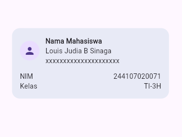

_Gambar 1.1: Tampilan normal sebelum `Expanded` dihapus. Teks nama menyesuaikan sisa ruang kartu._

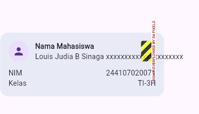

_Gambar 1.2: Tampilan setelah `Expanded` dihapus. Terjadi layout overflow._

- **Penjelasan:** Ketika `Expanded` pada baris nama dihapus, `Column` di dalam `Row` tidak lagi memiliki batasan lebar sisa ruang. Teks yang panjang memaksa elemen melebihi batas kanan `Container` (320px), sehingga Flutter menampilkan peringatan garis-garis kuning-hitam (_Yellow and Black Striped Overflow Pattern_).

---

#### Eksperimen 2: Perubahan `mainAxisSize` pada Column Utama


_Gambar 2.1: Tampilan kartu dengan `mainAxisSize: MainAxisSize.min`. Tinggi kartu pas mengikuti isi konten._


_Gambar 2.2: Tampilan kartu setelah diubah menjadi `mainAxisSize: MainAxisSize.max`._

- **Penjelasan:** Mengubah `mainAxisSize: MainAxisSize.min` menjadi `MainAxisSize.max` (nilai default `Column`) membuat kartu `Container` meregang secara vertikal hingga memenuhi seluruh tinggi ruang layar yang tersedia (_vertical stretch_).

---

#### Eksperimen 3: Penambahan Baris Data Email

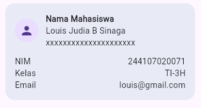

_Gambar 3.1: Hasil penambahan baris Email pada bagian bawah kartu profil._

- **Penjelasan:** Baris data baru (`Email`) berhasil ditambahkan di bawah baris Kelas. Dengan menerapkan pola kombinasi `Row` + `Expanded`, posisi label dan isi email sejajar rapi dengan data di atasnya tanpa memicu error _overflow_.

### B. Dashboard Responsif (Praktikum 5)

## 1. Tampilan Awal

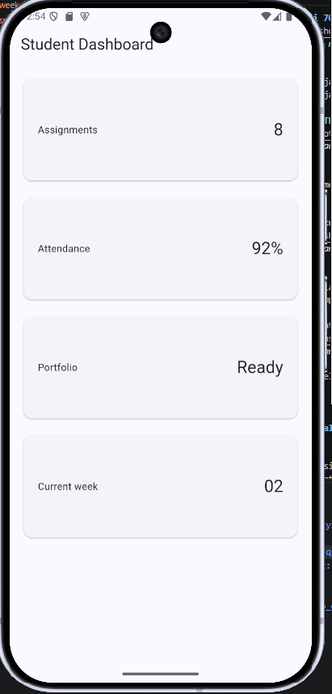

_Gambar 1.1: Tampilan awal aplikasi Student Dashboard pada layar sempit._

- **Deskripsi:** Pada saat pertama kali dijalankan, aplikasi menampilkan dashboard sederhana dengan layout 1 kolom dalam mode terang (_light mode_). Header menampilkan judul _Student Dashboard_ di pojok kiri atas.

---

## 2. Menambahkan Interaksi: StatefulWidget dan Cupertino

Aplikasi diubah menjadi `StatefulWidget` untuk mengelola _state_ perubahan tema secara dinamis. Widget `CupertinoSwitch` ditambahkan pada `AppBar` untuk mengubah mode tampilan antara terang dan gelap secara manual.

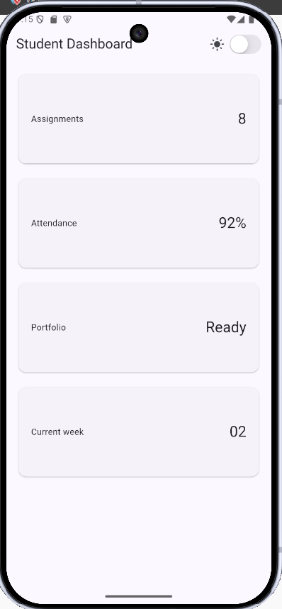

_Gambar 2.1: Tampilan sakelar CupertinoSwitch pada AppBar dalam mode terang._

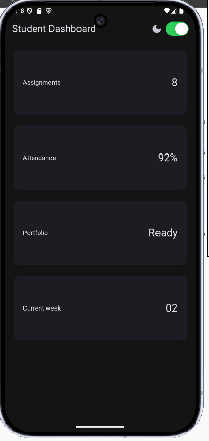

_Gambar 2.2: Tampilan sakelar CupertinoSwitch pada AppBar dalam mode gelap._

- **Deskripsi:**

  - Mengubah `DashboardApp` menjadi `StatefulWidget` memungkinkan aplikasi menyimpan variabel _state_ `_isDark`.

  - Saat `CupertinoSwitch` di-_toggle_, sakelar merespons perubahan mode secara visual (ikon matahari/bulan berubah) dan memanggil `setState()` untuk memperbarui tampilan aplikasi menjadi mode gelap (`darkTheme`) secara instan.

## 3. Sesuaikan DashboardPage Agar Menerima State dan Callback

Pada tahap ini, komponen UI dipisahkan secara lebih rapi. Halaman `DashboardPage` diubah agar bertindak sebagai _stateless presentation widget_ yang menerima variabel _state_ (`isDark`) dan fungsi _callback_ (`onDarkChanged`) dari parent widget (`DashboardApp`).


_Gambar 3.1: DashboardPage menerima state isDark (false) untuk menampilkan mode terang._


_Gambar 3.2: DashboardPage menerima state isDark (true) dan mengirimkan callback saat sakelar di-toggle._

- **Deskripsi:**

  - `DashboardPage` kini memiliki konstruktor yang membutuhkan parameter `isDark` dan `onDarkChanged`.

  - Sakelar `CupertinoSwitch` di dalam `AppBar` menggunakan nilai `isDark` untuk statusnya dan memanggil fungsi `onDarkChanged` saat terjadi interaksi pengguna.

  - Ketika sakelar digeser, sinyal _callback_ dikirimkan ke `DashboardApp` untuk mengeksekusi `setState()`, sehingga status tema aplikasi diperbarui dari tingkat atas tanpa menggabungkan logika _state_ di dalam halaman utama UI.

## 4. Eksperimen Layout

### 1. Mengubah Breakpoint dari 700 ke Nilai Lain

Pada eksperimen ini, dilakukan pengujian perubahan nilai _breakpoint_ pada `LayoutBuilder` untuk melihat bagaimana batas lebar layar mempengaruhi perubahan tata letak dari **1 kolom** (layar sempit) ke **2 kolom** (layar lebar).

---

#### A. Breakpoint Standar (700px)

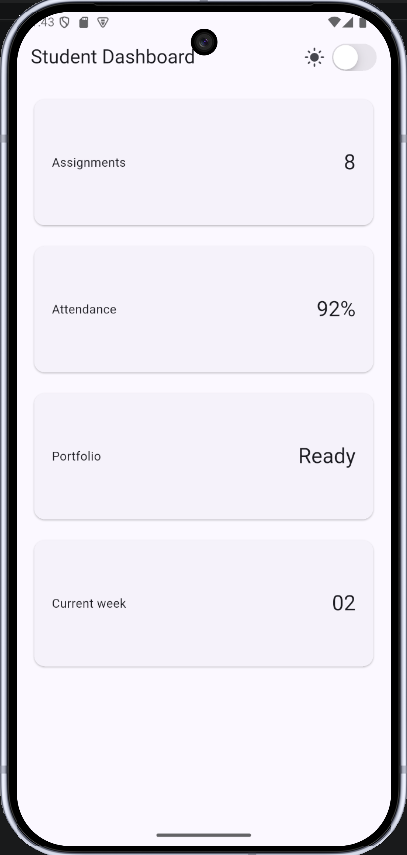

_Gambar 4.1: Tampilan aplikasi dengan breakpoint standar 700px._

- **Deskripsi:** Merupakan batas bawaan praktikum. Jika lebar layar `< 700px`, aplikasi menggunakan 1 kolom. Jika `≥ 700px`, aplikasi berubah menjadi 2 kolom.

- **Hasil Pengamatan:**

  - Pada emulator ponsel posisi potret (_portrait_), aplikasi berada pada mode **1 kolom**.

  - Aplikasi baru berpindah ke **2 kolom** ketika dijalankan di layar tablet atau ponsel posisi lanskap (_landscape_) yang cukup lebar.

---

#### B. Breakpoint Diturunkan ke 500px

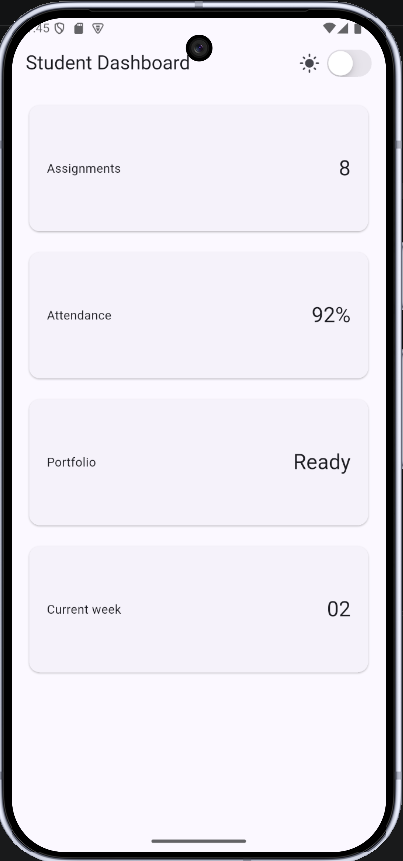

_Gambar 4.2: Tampilan aplikasi saat breakpoint diturunkan menjadi 500px._

- **Deskripsi:** Batas lebar layar diperkecil menjadi `500px` (`constraints.maxWidth >= 500`).

- **Hasil Pengamatan:**

  - Aplikasi menjadi lebih sensitif untuk berpindah ke mode **2 kolom**.

  - Ponsel dengan layar sedang pada posisi lanskap (_landscape_) atau ponsel berlayar agak lebar langsung memicu tampilan **2 kolom**, sehingga pemanfaatan ruang horizontal pada layar sedang menjadi lebih padat.

---

#### C. Breakpoint Dinaikkan ke 900px

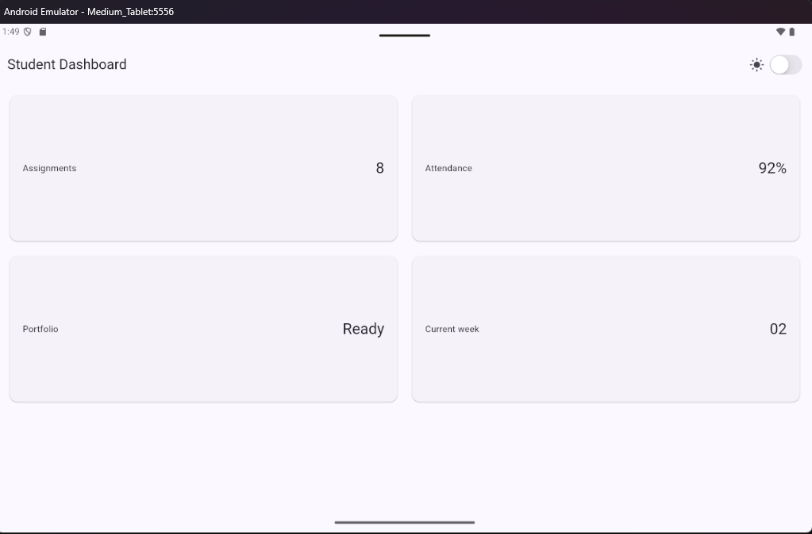

_Gambar 4.3: Tampilan aplikasi saat breakpoint dinaikkan menjadi 900px._

- **Deskripsi:** Batas lebar layar diperbesar menjadi `900px` (`constraints.maxWidth >= 900`).

- **Hasil Pengamatan:**

  - Aplikasi bertahan lebih lama dalam mode **1 kolom**.

  - Layar tablet kecil (ukuran 7–8 inci) tetap menampilkan layout **1 kolom** dan baru berubah menjadi **2 kolom** saat dijalankan di emulator tablet besar, layar monitor, atau mode desktop.

### 2. Mengubah `themeMode` ke `ThemeMode.dark` dan `ThemeMode.system`

Pada eksperimen ini, dilakukan pengujian konfigurasi `themeMode` pada `MaterialApp` untuk mengamati bagaimana aplikasi merespons pengaturan tema statis dan tema bawaan dari sistem operasi.

---

#### A. Pengujian `ThemeMode.dark`

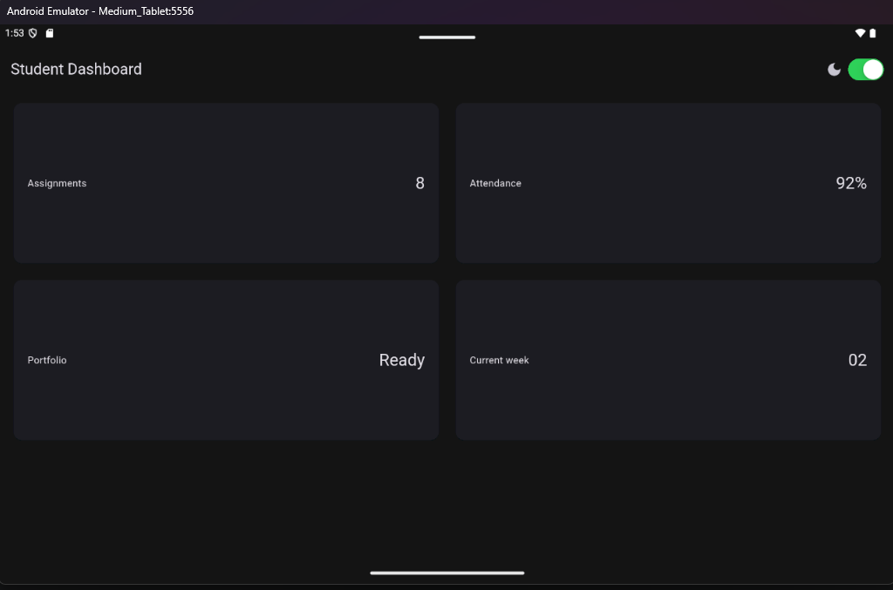

_Gambar 4.4: Tampilan aplikasi saat themeMode disetel ke ThemeMode.dark._

- **Deskripsi:** Properti `themeMode` pada `MaterialApp` diubah secara langsung/statis menjadi `ThemeMode.dark`.

- **Hasil Pengamatan:**

  - Aplikasi secara paksa selalu menggunakan skema warna mode gelap (`darkTheme`), tanpa memedulikan nilai dari variabel _state_ `_isDark` maupun posisi sakelar `CupertinoSwitch`.

  - Sakelar pada `AppBar` tidak lagi memiliki efek visual perubahan warna latar belakang aplikasi, karena konfigurasi `ThemeMode.dark` mengunci tema aplikasi di tingkat root (`MaterialApp`).

---

#### B. Pengalihan Kembali ke `ThemeMode.system`

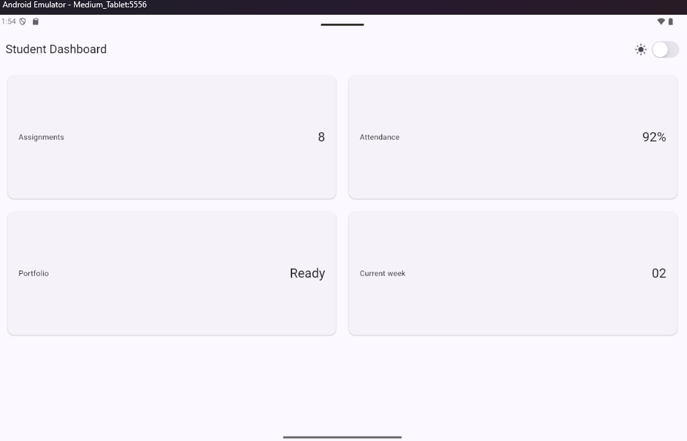

_Gambar 4.5: Tampilan aplikasi setelah dikembalikan ke ThemeMode.system._

- **Deskripsi:** Properti `themeMode` dikembalikan dari pengujian ke konfigurasi bawaan sistem, yaitu `ThemeMode.system`.

- **Hasil Pengamatan:**

  - Aplikasi secara otomatis mendeteksi dan mengikuti pengaturan tema global dari sistem operasi emulator/perangkat pengguna.

  - Jika perangkat sedang aktif dalam mode gelap (_Dark Theme_ pada pengaturan Android/iOS), aplikasi otomatis menerapkan `darkTheme`. Sebaliknya, jika perangkat berada dalam mode terang, aplikasi akan menerapkan `theme` (terang) secara otomatis tanpa memerlukan pemicu sakelar manual.

### 3. Uji Aplikasi dengan Ukuran Layar Emulator yang Berbeda

Pada eksperimen ini, aplikasi diuji menggunakan dua tipe perangkat dengan ukuran layar berbeda untuk memastikan responsivitas `LayoutBuilder` berjalan dengan baik.

---

#### A. Layar Sempit (Ponsel 5 Inci)

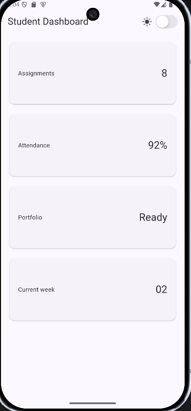

_Gambar 4.6: Tampilan aplikasi pada emulator ponsel berukuran 5 inci (< 700px)._

- **Deskripsi:** Pengujian dilakukan pada emulator ponsel dengan ukuran layar 5 inci.

- **Hasil Pengamatan:**

  - Lebar layar terdeteksi kurang dari `700px`, sehingga `LayoutBuilder` menyusun kartu informasi dalam **1 kolom vertikal**.

  - Tampilan terasa pas dan padat di layar sempit, seluruh teks dan nilai kartu dapat terbaca jelas tanpa terjadi _overflow_.

---

#### B. Layar Lebar (Tablet)

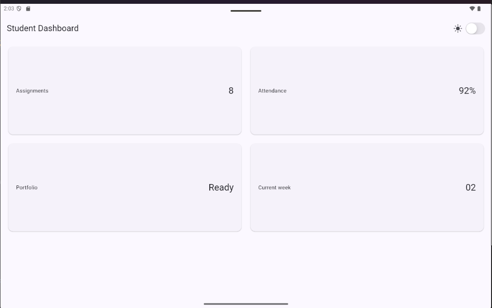

_Gambar 4.7: Tampilan aplikasi pada emulator tablet (≥ 700px)._

- **Deskripsi:** Pengujian dilakukan pada emulator berukuran layar lebar (Tablet).

- **Hasil Pengamatan:**

  - Karena lebar layar terdeteksi melebihi `700px`, `LayoutBuilder` secara otomatis mengubah tata letak menjadi **2 kolom bersisian**.

  - Penggunaan 2 kolom memanfaatkan ruang horizontal tablet yang luas secara efisien sehingga antarmuka tidak terlihat kosong.

### 4. Menambahkan Semantics untuk Screen Reader

Pada eksperimen ini, dilakukan penambahan widget `Semantics` pada komponen `CupertinoSwitch` dan `Card` indikator. Fitur ini diuji langsung menggunakan pembaca layar (_TalkBack_) untuk memastikan keterbacaan elemen antarmuka bagi pengguna penyandang disabilitas.

---

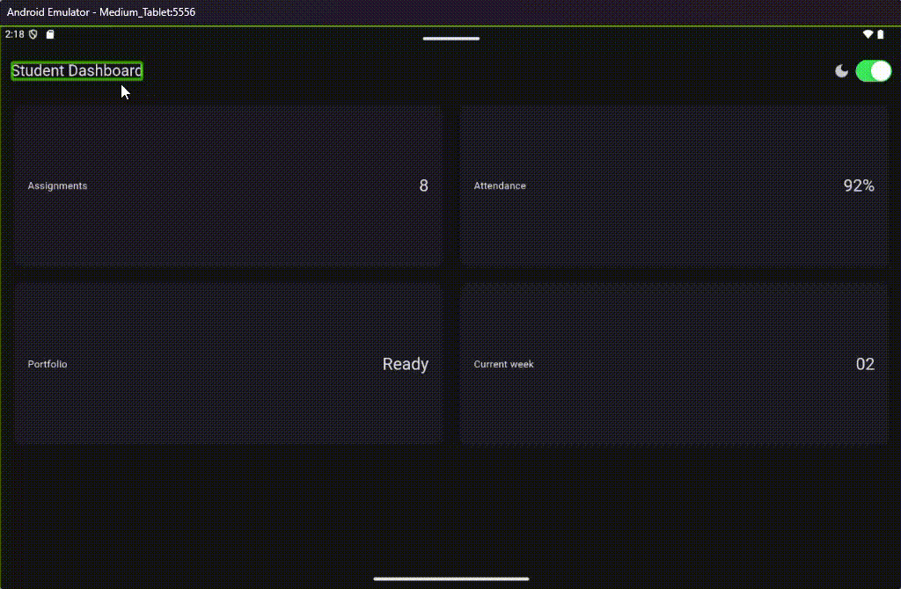

_Gambar 4.8: Animasi pengujian fitur TalkBack yang membacakan label Semantics saat elemen disentuh._

- **Deskripsi:** \* Widget `Semantics` membungkus `CupertinoSwitch` di `AppBar` dan seluruh komponen `Card` indikator pada dashboard.

  - Ketika fitur pembaca layar (TalkBack) aktif, sistem memberikan kotak fokus visual dan membacakan deskripsi yang telah disesuaikan melalui properti `label`.

- **Hasil Pengamatan:** _ **Pada Sakelar Tema:** Saat pembaca layar menyorot sakelar, sistem menyuarakan _"Sakelar ubah mode gelap dan terang"\* beserta status aktif/tidaknya.

  - **Pada Kartu Indikator:** Saat kartu disorot, pembaca layar membacakan konteks judul dan nilainya secara utuh (contoh: _"Indikator Assignments nilainya 8"_).

## 5. Tugas dan AI Design Exploration

---

## A. Implementasi Tugas Utama (Academic Overview Dashboard)

Halaman **Academic Overview Dashboard** telah dikembangkan secara utuh dengan memenuhi seluruh ketentuan teknis sebagai berikut:

1. **Header Profil & Kartu Informasi:**

   - Menampilkan **Header Profil** identitas mahasiswa (**Louis** - NIM **244107020071** - **Teknik Informatika**).

   - Menyediakan **4 kartu informasi akademik**: **IPK Kumulatif (3.5)**, **SKS Selesai (110 SKS)**, **Status Akademik (Aktif)**, dan **Semester Aktif (Semester 5)**.

2. **Penggunaan Widget Dasar Layout:**

   - Menggunakan kombinasi `Container`, `Row`, `Column`, dan `Expanded` untuk membentuk susunan komponen yang terstruktur dan rapi.

3. **Tata Letak Responsif:**

   - Memanfaatkan `LayoutBuilder` untuk mendeteksi lebar layar:

     - **Layar Sempit (< 700px):** Menampilkan tata letak **1 kolom** vertikal.

     - **Layar Lebar (≥ 700px):** Menampilkan tata letak **2 kolom** bersisian secara otomatis.

4. **Kustomisasi Tema (Light & Dark Theme):**

   - Menyediakan toggle sakelar `CupertinoSwitch` di `AppBar` yang mengontrol `ThemeMode` secara dinamis.

   - Elemen warna dan kontras teks telah disesuaikan agar tetap nyaman dibaca pada mode terang maupun mode gelap.

5. **Aksesibilitas (`Semantics`):**

   - Seluruh tombol interaktif dan kartu informasi dibungkus menggunakan widget `Semantics` dengan label deskriptif untuk keterbacaan pembaca layar (_screen reader / TalkBack_).

6. **Tangkapan Layar (Screenshots)**

* **Tampilan Layar Sempit (1 Kolom - HP, < 700px):**
  
  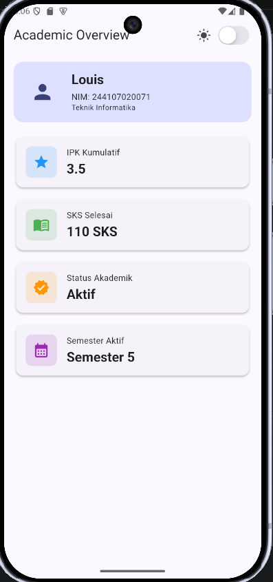

* **Tampilan Layar Lebar (2 Kolom - Tablet/Lanskap, ≥ 700px):**
  
  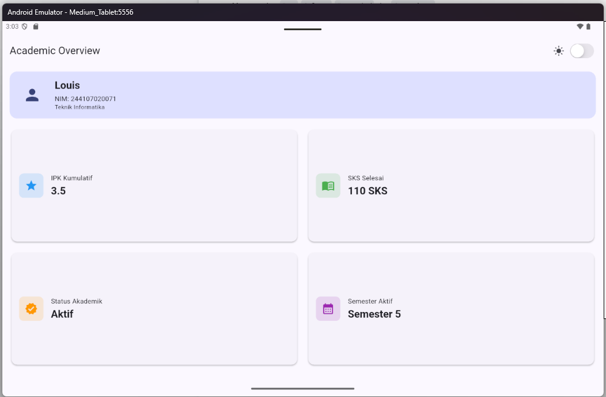

---

## B. # AI Prompt Challenge (Dokumentasi Challenge & Eksplorasi)

Dokumentasi ini berisi hasil eksekusi challenge pembandingan tata letak, penguatan konsep layout, verifikasi AI, serta keputusan teknis yang diterapkan pada aplikasi.

---

## 1. Prompt Desain: Pembandingan Tata Letak Dashboard

### Prompt

> "Bandingkan dua tata letak dashboard akademik untuk Flutter: versi GridView dan versi LayoutBuilder + Column. Jelaskan trade-off responsif dan aksesibilitasnya."

### Perbandingan & Trade-Off

- **Versi `GridView`:**

  - **Responsivitas:** Otomatis menyesuaikan kolom, namun ukuran kartu kaku karena terikat `childAspectRatio` yang berisiko _overflow_ pada layar sangat sempit.

  - **Aksesibilitas:** Menyuarakan posisi kisi (misal: _"Baris 1 Kolom 1"_), namun urutan _swipe_ antar-kolom kadang kurang intuitif bagi pengguna TalkBack.

- **Versi `LayoutBuilder` + `Column`:**

  - **Responsivitas:** Presisi tinggi karena struktur berganti eksplisit berdasarkan _breakpoint_ (misal: 1 kolom di `< 700px` dan 2 kolom di `≥ 700px`).

  - **Aksesibilitas:** Navigasi sangat linear dan mudah dipahami dari atas ke bawah pada layar sempit.

---

## 2. Prompt Penguatan Konsep: `Expanded` dalam `Row`

### Prompt

> "Jelaskan kapan penggunaan Expanded justru menyebabkan overflow di dalam Row, beri contoh kode yang gagal dan perbaikannya."

### Penjelasan Konsep

`Expanded` memaksa anak widget untuk mengambil sisa ruang yang tersedia. _Overflow_ terjadi jika `Expanded` diletakkan di dalam konteks **unbounded width** (misal: di dalam `Row` yang berada di dalam `SingleChildScrollView` horizontal tanpa batasan ukuran) atau ketika anak dari `Expanded` memiliki batas ukuran minimum yang melebihi sisa ruang.

### Contoh Kode Gagal & Perbaikan

- **Kode Gagal (Sebab _Overflow_ / Unbounded Width):**

  ```dart

  // SALAH: Row di dalam horizontal scroll view + Expanded

  SingleChildScrollView(

    scrollDirection: Axis.horizontal,

    child: Row(

      children: [

        Expanded(child: Text('Teks Panjang...')), // Error: Unbounded width

      ],

    ),

  )

  ```

- **Perbaikan Kode:**

```dart

// BENAR: Gunakan Flexible atau beri batasan lebar (SizedBox/Container)

SingleChildScrollView(

  scrollDirection: Axis.horizontal,

  child: Row(

    children: [

      SizedBox(

        width: 200,

        child: Text('Teks Panjang...', overflow: TextOverflow.ellipsis),

      ),

    ],

  ),

)

```

### 3. Verification Prompt: Self-Audit AI

#### Prompt

> *"Periksa kembali rekomendasi layout di atas: apakah tetap responsif di bawah 600px, apakah mengurangi aksesibilitas, dan apakah ada widget yang tidak tersedia di Flutter stabil saat ini?"*

#### Hasil Audit AI

* **Responsivitas (< 600px):** Layout berbasis `LayoutBuilder` + `Column` dipastikan tetap responsif di bawah 600px karena otomatis jatuh ke mode 1 kolom vertikal.

* **Dampak Aksesibilitas:** Tidak menurunkan aksesibilitas. Seluruh komponen dibungkus widget `Semantics` sehingga dapat dibaca dengan jelas oleh TalkBack.

* **Ketersediaan Widget:** Seluruh widget yang digunakan (`LayoutBuilder`, `Column`, `Row`, `Expanded`, `Card`, `CupertinoSwitch`, `Semantics`) merupakan widget standar yang tersedia di channel **Flutter Stable**.

### 4. Keputusan Teknis & Alasan Pemilihan

* **Keputusan yang Dipilih:** Menggunakan pendekatan **`LayoutBuilder` + `Column`**.

* **Alasan Teknis:**

  1. **Struktur Data Statis:** Jumlah kartu indikator pada *Academic Overview* bersifat tetap (4 kartu utama: IPK, SKS, Status, dan Semester), sehingga pendekatan `LayoutBuilder` lebih efisien dibanding `GridView`.

  2. **Kontrol Breakpoint Presisi:** Memberikan kontrol penuh pada *breakpoint* 700px untuk mengubah tampilan secara eksplisit dari 1 kolom linear (HP) menjadi 2 kolom bersisian (Tablet/Lanskap).

  3. **Aksesibilitas Optimal:** Menjaga alur navigasi pembaca layar (*screen reader* / TalkBack) tetap sekuensial dari atas ke bawah pada layar HP tanpa risiko kebingungan urutan fokus antar-kolom.

## 6. Refactoring Code

Proses refactoring dilakukan untuk meningkatkan kualitas kode (*clean code*), menghilangkan redundansi, serta mematuhi standar pengembangan antarmuka pada Flutter:

1. **Ekstraksi Widget Reusable (`InfoCard`):**

   * Menggabungkan komponen kartu indikator menjadi satu kelas `InfoCard` yang menerima parameter `title`, `value`, `icon`, dan `iconColor` sehingga tidak ada duplikasi kode widget.

2. **Penerapan Dynamic Theme (`Theme.of(context)`):**

   * Mengganti seluruh nilai warna dan gaya teks yang *hardcoded* menggunakan `Theme.of(context).colorScheme` dan `Theme.of(context).textTheme` agar elemen UI menyesuaikan mode terang (*Light*) dan gelap (*Dark*) secara otomatis.

3. **Konstanta Breakpoint Terpusat:**

   * Memindahkan nilai *breakpoint* responsif ke dalam satu konstanta global bernama `const double kWideBreakpoint = 700.0;` untuk menghindari penggunaan angka tanpa makna (*magic numbers*).

4. **Analisis Kualitas Kode (`flutter analyze`):**

   * Menjalankan perintah `flutter analyze` dan memastikan seluruh struktur kode bebas dari *error*, *warning*, maupun masalah *linter*.

---

## 🧪 Testing

Pengujian dilakukan untuk memastikan aplikasi dapat beradaptasi dengan berbagai ukuran layar serta bebas dari kesalahan analisis statis. Pengujian terdiri dari **widget testing** menggunakan Flutter Test, kemudian dilanjutkan dengan **static code analysis** menggunakan `flutter analyze`.

---

### A. Kode Pengujian (`test/widget_test.dart`)

```dart

import 'package:flutter/material.dart';

import 'package:flutter_test/flutter_test.dart';

import 'package:responsive_dashboard/main.dart';

void main() {

  testWidgets('Dashboard satu kolom di layar sempit', (tester) async {

    tester.view.physicalSize = const Size(400, 800);

    tester.view.devicePixelRatio = 1.0;

    addTearDown(tester.view.reset);

    await tester.pumpWidget(const DashboardApp());

    final width = tester.getSize(find.byType(Card).first).width;

    expect(width, lessThan(700));

  });

  testWidgets('Dashboard dua kolom di layar lebar', (tester) async {

    tester.view.physicalSize = const Size(1200, 800);

    tester.view.devicePixelRatio = 1.0;

    addTearDown(tester.view.reset);

    await tester.pumpWidget(const DashboardApp());

    final width = tester.getSize(find.byType(Card).first).width;

    expect(width, greaterThan(500));

  });

}

```

---

### B. Hasil Eksekusi Testing

#### 1. Static Code Analysis (`flutter analyze`)

Perintah berikut digunakan untuk memeriksa apakah terdapat error maupun warning pada source code.

```bash

flutter analyze

```

**Hasil:**

- ✅ No issues found!

- Tidak ditemukan error maupun warning pada proyek.

**Screenshot**

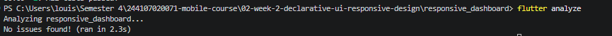

---

#### 2. Widget Testing (`flutter test`)

Perintah berikut digunakan untuk menjalankan seluruh pengujian widget.

```bash

flutter test

```

**Hasil:**

- ✅ All tests passed!

- Pengujian layout pada layar sempit (1 kolom) berhasil.

- Pengujian layout pada layar lebar (2 kolom) berhasil.

**Screenshot**

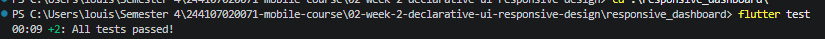

---

### C. Ringkasan Pengujian

| Pengujian | Status | Keterangan |

|-----------|:------:|------------|

| `flutter analyze` | ✅ Passed | Tidak ditemukan error maupun warning. |

| Layout layar sempit | ✅ Passed | Dashboard tampil dalam 1 kolom. |

| Layout layar lebar | ✅ Passed | Dashboard tampil dalam 2 kolom. |

| `flutter test` | ✅ Passed | Seluruh widget test berhasil dijalankan. |


## 7.Checklist Verifikasi

- [x] **`flutter analyze`** tidak menghasilkan error atau warning.

- [x] **`flutter test`** lulus semua widget test responsif (layar sempit & lebar).

- [x] **Aplikasi dapat dijalankan** dengan lancar pada ukuran layar sempit (< 700px) dan lebar (≥ 700px).

- [x] **Dark mode** memiliki kontras warna yang baik dan seluruh teks dapat terbaca dengan jelas.

- [x] **Struktur widget** terorganisir, menggunakan *reusable widget*, dan siap dijelaskan saat *code review*.

- [x] **Screenshot**, folder **`test/`**, dan **`README.md`** sudah tersimpan rapi pada folder tugas Week 2.

---

### Bukti Screenshot Verifikasi

* **Tampilan Layar Sempit (< 700px / HP - 1 Kolom):**
  
  

* **Tampilan Layar Lebar (≥ 700px / Tablet/Lanskap - 2 Kolom):**
  
  

* **Mode Terang (Light Mode):**
  
  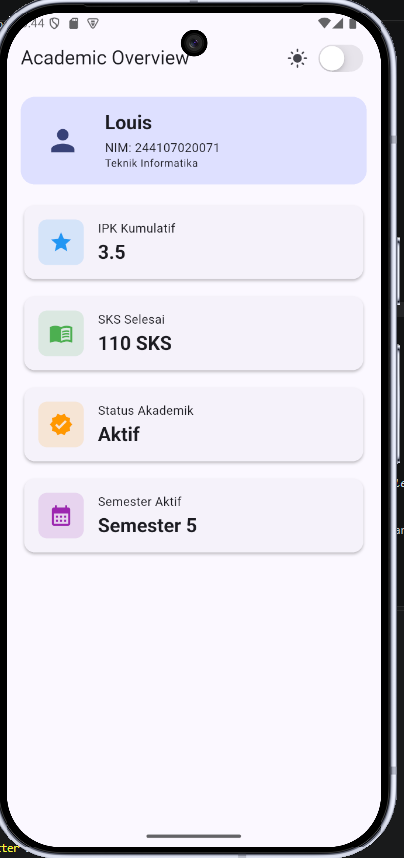

* **Mode Gelap (Dark Mode):**
  
  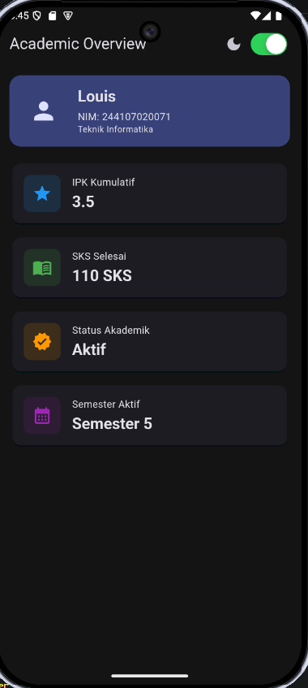

* **Hasil `flutter analyze` (0 Error / 0 Warning):**
  
  

* **Hasil `flutter test` (Semua Test Lolos):**
  
  
---

## 8. Refleksi

### 1. Perbedaan Cara Berpikir Imperative vs Declarative

* **Imperative:** Berfokus pada *bagaimana* mengubah antarmuka langkah demi langkah (misal: mencari elemen UI lalu memanipulasi propertinya secara manual seperti `button.setText()` atau `element.style.color = 'red'`).

* **Declarative:** Berfokus pada *apa* tampilan yang ingin disajikan berdasarkan kondisi data saat ini ($UI = f(state)$). Kita mendeskripsikan struktur UI untuk setiap kemungkinan *state*, dan Flutter memperbarui tampilannya secara otomatis saat *state* berubah.

---

### 2. Penggunaan Widget `Expanded`

* **Membantu Saat:** Berada di dalam widget fleksibel seperti `Row`, `Column`, atau `Flex` yang memiliki batasan ukuran pasti (*bounded constraints*), untuk memaksa anak widget mengisi sisa ruang yang tersedia tanpa keluar dari batas layar.

* **Menghasilkan Error (*Layout Overflow* / *Unbounded Constraints*):** Digunakan di dalam konteks yang tidak memiliki batasan ukuran spesifik (misal: dimasukkan langsung ke dalam `SingleChildScrollView` dengan arah *scroll* yang sejajar, atau di dalam `Row`/`Column` yang bersarang tanpa batasan lebar/tinggi).

---

### 3. Pengaruh Breakpoint dan Theme terhadap Pengalaman Pengguna (UX)

* **Breakpoint:** Memastikan tata letak aplikasi beradaptasi secara proporsional di berbagai ukuran layar (misal: 1 kolom di HP untuk kenyamanan pembacaan vertikal, dan 2 kolom di tablet untuk efisiensi ruang), mencegah elemen terlihat terlalu sempit atau longgar.

* **Theme:** Memberikan kenyamanan visual dan aksesibilitas. Mode Terang (*Light Mode*) memberikan keterbacaan tinggi di lingkungan cerah, sedangkan Mode Gelap (*Dark Mode*) mengurangi ketegangan mata di kondisi minim cahaya dan menghemat daya baterai.

---

### 4. Verifikasi Rekomendasi AI

1. **Kesesuaian Fitur API:** Memastikan properti atau widget yang disarankan tidak *deprecated* (seperti mengganti `.withOpacity()` menjadi `.withValues(alpha:)`).

2. **Kesesuaian Ekosistem Proyek:** Memverifikasi nama kelas utama (seperti `DashboardApp`) dan struktur paket agar tidak merusak fungsi pengujian otomatis (`flutter test`).

3. **Validasi Kualitas Kode:** Menjalankan `flutter analyze` untuk memastikan saran AI bebas dari *error/warning*, serta memastikan prinsip responsivitas dan aksesibilitas (`Semantics`) tetap terjaga.

