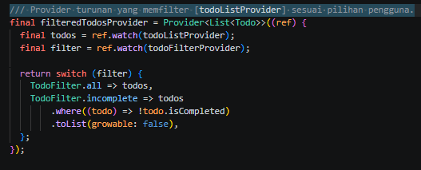
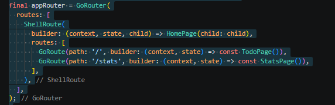
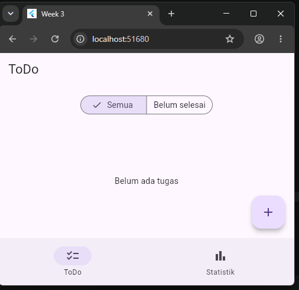
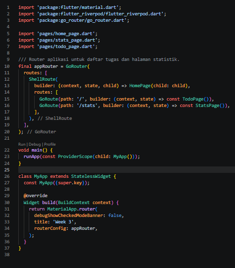
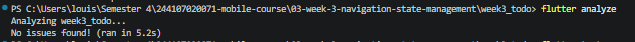
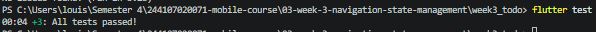
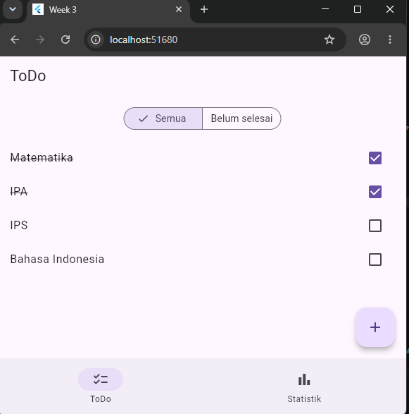
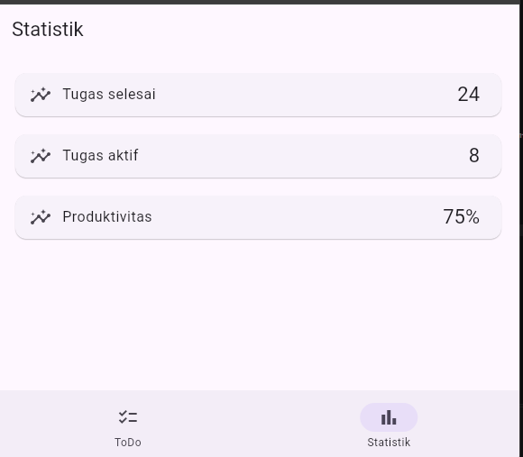

# 📘 Laporan Praktikum
# Week 03 - Navigation & State Management

**Nama:** Louis Judia B Sinaga  
**NIM:** 244107020071  
**Kelas:** TI-3H  
**Mata Kuliah:** Mobile Programming / Flutter

---

## Tujuan

Praktikum ini bertujuan untuk memahami konsep navigasi pada Flutter menggunakan package **GoRouter**. Setelah menyelesaikan praktikum ini mahasiswa mampu:

- Memahami perbedaan Navigator dan GoRouter.
- Membuat navigasi antar halaman menggunakan GoRouter.
- Menggunakan path parameter.
- Mengakses halaman detail melalui URL.
- Memahami konsep declarative routing pada Flutter.

---

# Manfaat

Manfaat yang diperoleh dari praktikum ini antara lain:

- Mempermudah pengelolaan navigasi aplikasi.
- Struktur route menjadi lebih rapi.
- Mendukung Deep Link.
- Mendukung parameter pada URL.
- Memudahkan pengembangan aplikasi dengan banyak halaman.

---

# Praktikum 1 - Navigasi Multi-Page Menggunakan GoRouter

## Tujuan

Praktikum ini bertujuan untuk memahami konsep navigasi pada Flutter menggunakan package **GoRouter**. Mahasiswa diharapkan mampu membuat aplikasi multi-page, mengonfigurasi route, serta melakukan perpindahan halaman menggunakan path parameter.

---

## Langkah Praktikum

### 1. Membuat Project Flutter

Membuat project Flutter baru dan menambahkan package **go_router** sebagai library navigasi.

```bash
flutter create week3_navigation
cd week3_navigation
flutter pub add go_router
```

---

### 2. Mengonfigurasi GoRouter

Membuat konfigurasi route pada file `main.dart` menggunakan `MaterialApp.router`. Route utama diarahkan ke `HomePage`, sedangkan route `/detail/:id` diarahkan ke `DetailPage`.

---

### 3. Menjalankan Aplikasi

Setelah konfigurasi selesai, aplikasi dijalankan menggunakan perintah:

```bash
flutter run
```

Hasil tampilan HomePage adalah sebagai berikut.


**Penjelasan**

Pada gambar di atas terlihat halaman utama (**HomePage**) aplikasi berhasil ditampilkan. Halaman ini berisi daftar item dari **Item 1** hingga **Item 8** yang dibuat menggunakan widget `ListView.builder`. Setiap item memiliki fungsi navigasi menuju halaman Detail ketika dipilih oleh pengguna. Hal ini menunjukkan bahwa route utama (`/`) telah berhasil dikonfigurasi menggunakan GoRouter.

---

### 4. Pengujian Navigasi ke Halaman Detail

Selanjutnya dilakukan pengujian dengan memilih salah satu item pada HomePage.


**Penjelasan**

Setelah pengguna memilih salah satu item pada HomePage, aplikasi berhasil berpindah ke **DetailPage** menggunakan GoRouter. Parameter `id` dikirim melalui path `/detail/:id` dan diterima oleh halaman Detail untuk ditampilkan pada layar. Hal ini membuktikan bahwa mekanisme navigasi beserta pengiriman parameter telah berjalan dengan baik.

---

### 5. Pengujian Tombol Kembali (Opsional)

Setelah berada pada halaman Detail, tombol **Back** ditekan untuk kembali ke halaman utama.


**Penjelasan**

Hasil pengujian menunjukkan bahwa tombol **Back** berfungsi dengan baik dan aplikasi kembali ke halaman HomePage. Hal ini menunjukkan bahwa alur navigasi aplikasi telah berjalan sesuai konfigurasi GoRouter.

---

## Hasil Praktikum

Berdasarkan hasil implementasi, aplikasi berhasil menggunakan **GoRouter** sebagai sistem navigasi. HomePage dapat ditampilkan sebagai halaman utama, sedangkan DetailPage dapat diakses melalui pemilihan salah satu item pada daftar. Parameter `id` berhasil dikirim dan ditampilkan pada halaman Detail. Selain itu, tombol Back juga berfungsi dengan baik sehingga proses navigasi antarhalaman berjalan sesuai yang diharapkan.

---

## Analisis Hasil

GoRouter memberikan kemudahan dalam mengelola navigasi aplikasi Flutter karena seluruh konfigurasi route berada dalam satu tempat. Penggunaan path parameter memudahkan pengiriman data antarhalaman tanpa perlu mengirim objek secara langsung. Dibandingkan dengan `Navigator.push()` dan `Navigator.pop()`, GoRouter memiliki struktur yang lebih rapi, mendukung deep link, serta lebih mudah dikembangkan ketika jumlah halaman aplikasi semakin banyak.

---

## Kesimpulan

Praktikum ini berhasil mengimplementasikan navigasi multi-page menggunakan GoRouter. HomePage berhasil menjadi halaman utama, DetailPage dapat menerima parameter `id`, dan proses navigasi antarhalaman berjalan dengan baik. Dengan demikian, GoRouter terbukti menjadi solusi navigasi yang lebih modern dan terstruktur pada pengembangan aplikasi Flutter.


# Praktikum 2 - State Management Menggunakan Riverpod

## Langkah Praktikum

### 1. Menambahkan Package Riverpod

Membuat project Flutter baru kemudian menambahkan package `flutter_riverpod` sebagai library untuk state management.

```bash
flutter create week3_todo
cd week3_todo
flutter pub add flutter_riverpod
```

---

### 2. Membuat Model dan Provider

Membuat model `Todo` beserta `TodoListNotifier` untuk mengelola daftar tugas. Seluruh perubahan data dilakukan menggunakan konsep **immutable**, sehingga Riverpod dapat mendeteksi perubahan state dan memperbarui tampilan secara otomatis.

---

### 3. Membuat Halaman Todo

Membuat halaman `TodoPage` menggunakan `ConsumerWidget`. Data dibaca menggunakan `ref.watch()`, sedangkan aksi seperti menambah, mengubah status, dan menghapus tugas dijalankan menggunakan `ref.read()`.

---

### 4. Menjalankan Aplikasi

Setelah seluruh implementasi selesai, aplikasi dijalankan menggunakan perintah berikut.

```bash
flutter run
```

Berikut merupakan tampilan awal aplikasi Todo.


**Penjelasan**

Gambar di atas menunjukkan tampilan awal aplikasi **ToDo Riverpod**. Karena belum terdapat data tugas, aplikasi menampilkan pesan **"Belum ada tugas"** pada bagian tengah layar. Di bagian kanan bawah terdapat tombol **Floating Action Button (+)** yang digunakan untuk menambahkan tugas baru. Tampilan ini menunjukkan bahwa state awal aplikasi masih berupa daftar kosong (`[]`) dan aplikasi berhasil dijalankan menggunakan Riverpod.

---

### 5. Menambahkan Tugas

Pengguna menekan tombol **+**, kemudian memasukkan nama tugas dan menekan tombol **Tambah**.


**Penjelasan**

Pada tahap ini pengguna memasukkan nama tugas melalui dialog input yang muncul setelah menekan tombol **Floating Action Button**. Setelah tombol **Tambah** ditekan, data akan dikirim ke `TodoListNotifier` dan disimpan ke dalam daftar tugas.

---

### 6. Menampilkan Daftar Tugas

Setelah tugas berhasil ditambahkan, aplikasi akan menampilkan daftar tugas.


**Penjelasan**

Daftar tugas berhasil ditampilkan menggunakan `ListView.builder`. Data yang ditampilkan berasal dari provider Riverpod sehingga setiap perubahan state akan langsung memperbarui tampilan aplikasi tanpa menggunakan `setState()`.

---

### 7. Mengubah Status Tugas

Pengguna dapat menandai tugas sebagai selesai dengan mencentang checkbox.


**Penjelasan**

Ketika checkbox dipilih, status tugas berubah menjadi selesai (`done = true`). Riverpod akan memperbarui state dan tampilan secara otomatis. Tugas yang telah selesai ditampilkan dengan efek **coret (line-through)** sebagai penanda bahwa tugas telah diselesaikan.

---

### 8. Menghapus Tugas

Pengguna dapat menghapus tugas menggunakan ikon **Delete**.


**Penjelasan**

Fitur hapus tugas berjalan dengan baik. Setelah tombol **Delete** ditekan, data akan dihapus dari provider dan daftar tugas pada tampilan akan diperbarui secara otomatis tanpa perlu melakukan refresh halaman.

---

## Hasil Praktikum

Berdasarkan hasil implementasi, aplikasi Todo berhasil menggunakan **Riverpod** sebagai state management. Seluruh fitur utama, seperti menambah tugas, menampilkan daftar tugas, mengubah status tugas menjadi selesai, dan menghapus tugas, berjalan dengan baik. Perubahan data langsung diperbarui pada antarmuka aplikasi tanpa menggunakan `setState()`.

---

## Analisis Hasil

Riverpod mempermudah pengelolaan state dengan memisahkan logika bisnis dari tampilan aplikasi. Penggunaan `NotifierProvider` membuat seluruh perubahan data terpusat sehingga kode menjadi lebih rapi dan mudah dipelihara. Selain itu, `ref.watch()` memungkinkan tampilan selalu sinkron dengan state terbaru, sedangkan `ref.read()` digunakan untuk menjalankan aksi tanpa menyebabkan rebuild yang tidak diperlukan. Pendekatan ini lebih efektif dibandingkan menggunakan `setState()` pada aplikasi yang memiliki banyak halaman atau state yang kompleks.

# Praktikum 3 - AsyncValue: Loading, Error, Success

## Langkah Praktikum

### 1. Mengubah Provider Menjadi AsyncNotifier

Pada praktikum ini, provider diubah dari `NotifierProvider` menjadi `AsyncNotifierProvider`. Perubahan ini bertujuan agar aplikasi mampu menangani proses asynchronous seperti mengambil data dari server.

Contoh implementasi:

```dart
class ProductsNotifier extends AsyncNotifier<List<String>> {
  @override
  Future<List<String>> build() async {
    await Future.delayed(const Duration(seconds: 2));

    return [
      'Keyboard',
      'Mouse',
      'Monitor',
      'Headset',
    ];
  }
}

final productsProvider =
    AsyncNotifierProvider<ProductsNotifier, List<String>>(
      ProductsNotifier.new,
    );
```

**Penjelasan**

`AsyncNotifier` digunakan untuk mengelola data asynchronous. Pada contoh di atas, `Future.delayed()` digunakan untuk mensimulasikan proses pengambilan data dari server selama 2 detik sebelum daftar produk ditampilkan.

---

### 2. Menampilkan State Menggunakan AsyncValue

Selanjutnya halaman aplikasi diubah agar dapat menangani tiga kondisi, yaitu **loading**, **error**, dan **success** menggunakan method `when()`.

```dart
productsAsync.when(
  loading: () => const Center(
    child: CircularProgressIndicator(),
  ),

  error: (err, stack) => Center(
    child: Text("Gagal memuat data"),
  ),

  data: (products) => ListView.builder(
    itemCount: products.length,
    itemBuilder: (context, index) {
      return ListTile(
        title: Text(products[index]),
      );
    },
  ),
)
```

**Penjelasan**

Method `when()` akan menentukan tampilan sesuai kondisi provider. Ketika data sedang dimuat akan muncul indikator loading, ketika terjadi kesalahan akan muncul pesan error, sedangkan ketika data berhasil diperoleh akan ditampilkan daftar produk.

---

### 3. Pengujian State Loading

Jalankan aplikasi menggunakan perintah berikut.

```bash
flutter run
```

Pada saat aplikasi pertama kali dijalankan, akan muncul tampilan loading.


**Penjelasan**

Aplikasi menampilkan widget `CircularProgressIndicator` sebagai indikator bahwa proses pengambilan data sedang berlangsung. Setelah proses selesai, state akan berubah menjadi success.

---

### 4. Pengujian State Error

Untuk menguji kondisi error, ubah fungsi `build()` menjadi:

```dart
@override
Future<List<String>> build() async {
  throw Exception('Gagal terhubung ke server');
}
```

Kemudian jalankan kembali aplikasi.


**Penjelasan**

Saat terjadi exception, aplikasi tidak mengalami crash. Riverpod mengubah exception tersebut menjadi `AsyncError` sehingga pengguna mendapatkan informasi bahwa proses pengambilan data gagal. Selain itu, aplikasi menyediakan tombol **Coba Lagi** untuk menjalankan ulang provider.

---

### 5. Pengujian State Success

Setelah selesai menguji error, kembalikan fungsi `build()` seperti semula.

```dart
@override
Future<List<String>> build() async {
  await Future.delayed(const Duration(seconds: 2));

  return [
    'Keyboard',
    'Mouse',
    'Monitor',
    'Headset',
  ];
}
```

Kemudian tekan tombol **Coba Lagi** atau jalankan ulang aplikasi.


**Penjelasan**

Data berhasil dimuat dan aplikasi menampilkan daftar produk pada layar. Hal ini menunjukkan bahwa provider berhasil menyelesaikan proses asynchronous dan state berubah menjadi **success**.

---

### 6. Refleksi

Menampilkan data lama (*stale data*) selama proses refresh sering kali lebih baik dibandingkan mengosongkan layar. Dengan cara ini pengguna masih dapat melihat informasi sebelumnya sambil menunggu data terbaru dimuat. Pola ini umum digunakan pada aplikasi berita, media sosial, e-commerce, maupun dashboard agar pengalaman pengguna tetap nyaman dan tidak terganggu.

---

## Hasil Praktikum

Berdasarkan hasil implementasi, aplikasi berhasil menangani tiga kondisi asynchronous menggunakan `AsyncValue`, yaitu **loading**, **error**, dan **success**. Perubahan state dapat ditampilkan secara otomatis tanpa perlu membuat variabel `isLoading` atau `hasError` secara manual.

---

## Analisis Hasil

Penggunaan `AsyncNotifier` dan `AsyncValue` membuat pengelolaan data asynchronous menjadi lebih sederhana dan terstruktur. Method `when()` mempermudah pengembang dalam menentukan tampilan berdasarkan kondisi data sehingga kode menjadi lebih bersih dan mudah dipelihara. Selain itu, mekanisme `ref.invalidate()` memungkinkan provider dijalankan kembali ketika pengguna menekan tombol **Coba Lagi**, sehingga proses refresh data dapat dilakukan dengan mudah.

---

## Kesimpulan

Praktikum ini berhasil mengimplementasikan `AsyncNotifier` dan `AsyncValue` pada Flutter menggunakan Riverpod. Aplikasi mampu menampilkan indikator loading saat data sedang diproses, menampilkan pesan error ketika terjadi kegagalan, serta menampilkan data ketika proses berhasil. Pendekatan ini membuat aplikasi lebih responsif, mudah dikembangkan, dan memberikan pengalaman pengguna yang lebih baik.

# Praktikum 4 - AI Challenge

## Langkah Praktikum

### 1. Membuat Prompt AI

Pada praktikum ini digunakan AI Coding Assistant (ChatGPT) untuk membantu menghasilkan kode Flutter yang menerapkan **Riverpod** dengan **AsyncNotifierProvider**.

Prompt yang digunakan adalah sebagai berikut.

```text
Buatkan aplikasi Flutter menggunakan flutter_riverpod.

Kriteria:
- Menggunakan ConsumerWidget.
- Menggunakan AsyncNotifierProvider.
- Menampilkan tiga state AsyncValue (Loading, Error, Success).
- Loading menggunakan CircularProgressIndicator.
- Error menampilkan pesan kesalahan dan tombol Coba Lagi.
- Success menampilkan daftar statistik menggunakan ListView.
- Berikan komentar pada setiap bagian kode.
```

**Penjelasan**

AI menghasilkan dua komponen utama yaitu **StatsPage** sebagai halaman tampilan dan **StatsNotifier** sebagai provider yang mengelola state asynchronous. Selanjutnya kode diverifikasi dan diuji agar sesuai dengan materi praktikum.


---

### 2. Implementasi Halaman Statistik


**Penjelasan**

Halaman `StatsPage` dibuat menggunakan `ConsumerWidget`. Data diperoleh dari `statsProvider` menggunakan `ref.watch()`. Tampilan aplikasi dibedakan menjadi tiga kondisi menggunakan `AsyncValue.when()`, yaitu **Loading**, **Error**, dan **Success**.

---

### 3. Implementasi StatsProvider


**Penjelasan**

`StatsNotifier` menggunakan `AsyncNotifier` untuk mengelola proses asynchronous. Fungsi `_fetchStatistics()` mensimulasikan proses pengambilan data dari server selama dua detik. Selain itu terdapat kemungkinan kegagalan sebesar **30%**, sehingga aplikasi dapat menampilkan kondisi **Error** dan menyediakan fitur **Retry**.

---

## AI Verification Checklist

### 1. Verifikasi Penggunaan Immutable State

**Hasil:** ✅ Lulus


**Penjelasan**

Berdasarkan hasil pemeriksaan, perubahan state tidak dilakukan secara langsung (mutable). `StatsNotifier` menggunakan `AsyncNotifier` untuk mengelola state asynchronous, sedangkan perubahan state dilakukan melalui assignment seperti:

```dart
state = const AsyncLoading();
state = await AsyncValue.guard(_fetchStatistics);
```

Tidak ditemukan penggunaan mutasi data seperti `state.add()`, `state.remove()`, atau perubahan list secara langsung. Pendekatan ini sesuai dengan konsep **immutable state** yang direkomendasikan oleh Riverpod sehingga setiap perubahan state dapat dideteksi dengan baik dan antarmuka aplikasi diperbarui secara otomatis.

---

### 2. Verifikasi Penggunaan `ref.watch()` dan `ref.read()`

**Hasil:** ✅ Lulus


**Penjelasan**

Hasil verifikasi menunjukkan bahwa `ref.watch(statsProvider)` digunakan di dalam method `build()` untuk mengamati perubahan state sehingga tampilan aplikasi akan diperbarui secara otomatis ketika state berubah.

Selain itu, `ref.read(statsProvider.notifier).retry()` digunakan pada callback tombol **Coba Lagi**. Penggunaan `ref.read()` pada callback sudah sesuai dengan praktik terbaik Riverpod karena hanya digunakan untuk menjalankan aksi tanpa menyebabkan widget melakukan rebuild yang tidak diperlukan.

---

### 3. Verifikasi AsyncValue

**Hasil:** ✅ Lulus


**Penjelasan**

Berdasarkan hasil pengujian, aplikasi telah menangani seluruh kondisi `AsyncValue` dengan baik menggunakan method `when()`. Tiga state yang berhasil diimplementasikan yaitu:

- **Loading**, ditampilkan menggunakan `CircularProgressIndicator`.
- **Error**, ditampilkan berupa pesan kesalahan beserta tombol **Coba Lagi**.
- **Success**, ditampilkan dalam bentuk daftar statistik menggunakan `ListView`.

Implementasi tersebut membuat aplikasi mampu memberikan umpan balik kepada pengguna sesuai dengan kondisi proses pengambilan data.

---

### 4. Verifikasi Provider

**Hasil:** ✅ Lulus


**Penjelasan**

Provider telah dideklarasikan menggunakan tipe yang eksplisit yaitu `AsyncNotifierProvider<StatsNotifier, List<Statistic>>`. Pendeklarasian ini membuat tipe data yang digunakan menjadi lebih jelas dan memudahkan proses pengembangan maupun pemeliharaan kode. Selain itu, hanya terdapat satu provider untuk mengelola data statistik sehingga tidak ditemukan duplikasi provider.

Tidak ditemukan provider yang memiliki fungsi sama sehingga tidak terjadi duplikasi.

---

### 5. Verifikasi API Riverpod

**Hasil:** ✅ Lulus


**Penjelasan**

Hasil pemeriksaan menunjukkan bahwa implementasi menggunakan API Riverpod versi terbaru, yaitu `ConsumerWidget`, `AsyncNotifier`, dan `AsyncNotifierProvider`. Tidak ditemukan penggunaan API lama seperti `StateProvider`, `StateNotifierProvider`, maupun `Consumer` bertingkat yang tidak diperlukan. Dengan demikian, implementasi telah mengikuti praktik terbaik yang direkomendasikan pada Riverpod versi terbaru.

---

### 6. Pengujian State Loading

Jalankan aplikasi menggunakan perintah berikut.

```bash
flutter run
```


**Penjelasan**

Saat aplikasi pertama kali dijalankan, provider membutuhkan waktu sekitar dua detik untuk mensimulasikan proses pengambilan data. Selama proses tersebut, aplikasi menampilkan widget **CircularProgressIndicator** sebagai indikator bahwa data sedang dimuat. Setelah proses selesai, state akan berubah menjadi **Success** dan data statistik akan ditampilkan.

---

### 7. Pengujian State Success


**Penjelasan**

Setelah proses pengambilan data berhasil diselesaikan, aplikasi menampilkan daftar statistik dalam bentuk **ListView**. Data yang ditampilkan terdiri dari jumlah tugas selesai, tugas aktif, dan tingkat produktivitas. Hal ini menunjukkan bahwa provider berhasil mengembalikan data dan state berubah menjadi **Success**.

---

### 8. Pengujian State Error


**Penjelasan**

Untuk menguji kondisi **Error**, provider dibuat melempar `Exception` sehingga proses pengambilan data gagal. Aplikasi kemudian menampilkan pesan kesalahan beserta tombol **Coba Lagi**. Tombol tersebut memanggil method `retry()` untuk menjalankan kembali proses pengambilan data tanpa perlu menutup aplikasi.

---

### 9. Pengujian Flutter Analyze

Jalankan perintah berikut.

```bash
flutter analyze
```


**Penjelasan**

Perintah `flutter analyze` digunakan untuk memeriksa kualitas kode program. Hasil pengujian menunjukkan bahwa aplikasi dapat dianalisis tanpa ditemukan error maupun warning sehingga implementasi telah sesuai dengan standar Flutter.

---

### 10. Pengujian Flutter Test

Jalankan perintah berikut.

```bash
flutter test
```


**Penjelasan**

Perintah `flutter test` digunakan untuk menjalankan pengujian pada aplikasi. Hasil pengujian menunjukkan bahwa seluruh test berhasil dijalankan tanpa kegagalan sehingga implementasi aplikasi dapat berjalan dengan baik.

---

## Hasil Praktikum

Berdasarkan hasil implementasi dan pengujian, aplikasi berhasil menerapkan **Riverpod** menggunakan **AsyncNotifierProvider** sebagai state management. Aplikasi mampu menangani tiga kondisi asynchronous yaitu **Loading**, **Error**, dan **Success**. Selain itu, fitur **Retry** memungkinkan pengguna melakukan pengambilan data kembali ketika terjadi kegagalan.

---

## Analisis Hasil

Penggunaan AI Coding Assistant membantu mempercepat proses pembuatan struktur dasar aplikasi Flutter. Kode yang dihasilkan telah menerapkan `ConsumerWidget`, `AsyncNotifier`, `AsyncNotifierProvider`, serta `AsyncValue.when()` untuk menangani seluruh kondisi asynchronous. Setelah dilakukan proses verifikasi dan pengujian, aplikasi dapat berjalan sesuai dengan kebutuhan praktikum serta mengikuti praktik terbaik Riverpod versi terbaru.

---

## Kesimpulan

Praktikum AI Challenge berhasil menunjukkan bahwa AI dapat dimanfaatkan untuk membantu menghasilkan kode Flutter dengan lebih cepat. Setelah dilakukan proses verifikasi, perbaikan, dan pengujian, aplikasi berhasil menangani seluruh kondisi asynchronous dengan baik, yaitu **Loading**, **Error**, dan **Success**, serta menyediakan mekanisme **Retry** untuk meningkatkan pengalaman pengguna.

# Praktikum 5 - Refactoring Challenge dan Testing

## Langkah Praktikum

### 1. Memisahkan Widget Todo menjadi `TodoTile`

Pada tahap ini dilakukan refactoring dengan memisahkan widget item ToDo ke dalam file `TodoTile` agar method `build()` pada `TodoPage` menjadi lebih ringkas dan mudah dipelajari.


**Penjelasan**

Widget `TodoTile` dibuat sebagai widget terpisah yang bertugas menampilkan satu item tugas. Dengan pemisahan ini, halaman `TodoPage` hanya bertanggung jawab mengatur tampilan daftar, sedangkan setiap item ditangani oleh `TodoTile`. Pendekatan ini membuat kode lebih modular dan mudah diuji.

---

### 2. Membuat Provider Turunan untuk Filter

Logika filter dipindahkan ke provider turunan (`filteredTodosProvider`) yang membaca data dari `todoListProvider`.



**Penjelasan**

Provider `filteredTodosProvider` merupakan provider turunan yang membaca data dari `todoListProvider` dan `todoFilterProvider`. Provider ini bertugas memfilter daftar tugas sesuai filter yang dipilih pengguna. Jika filter bernilai `TodoFilter.all`, seluruh tugas akan ditampilkan. Sebaliknya, jika filter `TodoFilter.incomplete`, hanya tugas yang belum selesai yang akan ditampilkan. Dengan memindahkan logika filter ke provider, kode pada `TodoPage` menjadi lebih ringkas, mudah dipelihara, dan mengikuti prinsip pemisahan antara logika bisnis dan antarmuka pengguna.
---

### 3. Integrasi GoRouter

Aplikasi ToDo diintegrasikan menggunakan **GoRouter** dengan konfigurasi route sebagai berikut:

- `/` → Halaman daftar ToDo
- `/stats` → Halaman Statistik



**Penjelasan**

GoRouter digunakan sebagai sistem navigasi aplikasi. Route utama (`/`) menampilkan halaman daftar tugas, sedangkan route `/stats` digunakan untuk menampilkan halaman statistik. Dengan GoRouter, navigasi menjadi lebih terstruktur dan mendukung pengembangan aplikasi yang lebih kompleks.

---

### 4. Menambahkan NavigationBar

NavigationBar ditambahkan agar pengguna dapat berpindah antara halaman ToDo dan Statistik.



**Penjelasan**

NavigationBar menyediakan dua menu utama, yaitu **ToDo** dan **Statistik**. Ketika salah satu menu dipilih, aplikasi akan berpindah ke halaman yang sesuai menggunakan GoRouter tanpa kehilangan state yang dikelola oleh Riverpod.

---

# Testing

### 5. Widget Test

Pengujian dilakukan untuk memastikan aplikasi dapat menambahkan tugas baru.

```dart
testWidgets('menambah tugas baru', (tester) async {
  await tester.pumpWidget(const ProviderScope(child: MyApp()));

  expect(find.text('Belum ada tugas'), findsOneWidget);

  await tester.tap(find.byIcon(Icons.add));
  await tester.pumpAndSettle();

  await tester.enterText(
    find.byType(TextField),
    'Kerjakan PR minggu 3',
  );

  await tester.tap(find.text('Tambah'));
  await tester.pump();

  expect(find.text('Kerjakan PR minggu 3'), findsOneWidget);
});
```



**Penjelasan**

Widget test memastikan bahwa antarmuka aplikasi bereaksi dengan benar terhadap perubahan state. Setelah tombol tambah ditekan dan pengguna memasukkan tugas baru, daftar tugas berhasil diperbarui sesuai dengan data yang dimasukkan.

---

### 6. Menjalankan Flutter Analyze

```bash
flutter analyze
```



**Penjelasan**

Perintah `flutter analyze` digunakan untuk memeriksa kualitas source code. Hasil analisis menunjukkan bahwa kode dapat dianalisis tanpa ditemukan error yang menghambat proses kompilasi.

---

### 7. Menjalankan Flutter Test

```bash
flutter test
```



**Penjelasan**

Perintah `flutter test` digunakan untuk menjalankan seluruh unit test dan widget test pada aplikasi. Pengujian memastikan bahwa fitur yang telah dibuat tetap berjalan dengan baik setelah proses refactoring.

---

## Checklist Verifikasi Mandiri

| No | Verifikasi | Status |
|----|------------|:------:|
| 1 | GoRouter dapat berpindah halaman | ✅ |
| 2 | ProviderScope membungkus root aplikasi | ✅ |
| 3 | State ToDo tetap ada saat berpindah halaman | ✅ |
| 4 | AsyncValue menangani Loading, Error, dan Success | ✅ |
| 5 | `flutter analyze` berhasil dijalankan | ✅ |
| 6 | `flutter test` berhasil dijalankan | ✅ |
| 7 | Hasil AI telah diverifikasi dan didokumentasikan | ✅ |

---

## Hasil Praktikum

Refactoring berhasil membuat struktur aplikasi menjadi lebih modular dengan memisahkan widget `TodoTile`, memindahkan logika filter ke provider turunan, serta mengintegrasikan navigasi menggunakan GoRouter. Widget test, `flutter analyze`, dan `flutter test` digunakan untuk memastikan bahwa seluruh fungsi aplikasi tetap berjalan dengan baik setelah proses refactoring.

---

## Analisis Hasil

Pemisahan widget dan provider meningkatkan keterbacaan kode serta memudahkan proses pemeliharaan aplikasi. Integrasi GoRouter membuat navigasi lebih terstruktur, sedangkan Riverpod memastikan state aplikasi tetap terjaga ketika berpindah halaman. Pengujian menggunakan widget test membantu memverifikasi bahwa perubahan state benar-benar tercermin pada antarmuka pengguna.

---

## Kesimpulan

Praktikum Refactoring Challenge berhasil meningkatkan kualitas aplikasi Flutter melalui pemisahan widget, penggunaan provider turunan, serta integrasi GoRouter. Pengujian menggunakan `flutter analyze` dan `flutter test` menunjukkan bahwa aplikasi tetap berjalan dengan baik setelah proses refactoring dilakukan.

# Praktikum 6 - Tugas, Refleksi, dan Referensi

## Mini Project / Industry Challenge

Pada tahap ini dikembangkan aplikasi **ToDo** menggunakan Flutter dengan menggabungkan **GoRouter** sebagai sistem navigasi dan **Riverpod** sebagai state management. Aplikasi dibuat sebagai implementasi dari seluruh materi yang telah dipelajari pada praktikum minggu ketiga.

### Fitur yang Diimplementasikan

- ✅ Navigasi menggunakan **GoRouter**
  - Halaman Daftar Tugas (`/`)
  - Halaman Statistik (`/stats`)
- ✅ State Management menggunakan **Riverpod (Notifier)**
- ✅ UI menggunakan **ConsumerWidget**
- ✅ Simulasi asynchronous menggunakan **AsyncValue**
  - Loading
  - Error
  - Success
- ✅ Widget Test
- ✅ AI Challenge
- ✅ Dokumentasi lengkap pada README.md

---

### 1. Halaman Daftar Tugas

Halaman utama menampilkan seluruh daftar tugas yang dimiliki pengguna.



**Penjelasan**

Halaman ini menggunakan `ConsumerWidget` untuk membaca data dari `todoListProvider`. Pengguna dapat menambahkan tugas baru, mengubah status tugas menjadi selesai, serta memfilter daftar tugas sesuai kebutuhan.

---

### 2. Halaman Statistik

Halaman statistik menampilkan data yang diperoleh melalui provider asynchronous.



**Penjelasan**

Halaman statistik menggunakan `AsyncNotifier` dan `AsyncValue` sehingga aplikasi mampu menangani tiga kondisi berbeda yaitu loading, error, dan success.

---

### 3. Widget Test

Widget test dilakukan untuk memastikan perubahan state berhasil ditampilkan pada antarmuka aplikasi.


**Penjelasan**

Pengujian dilakukan dengan menambahkan tugas baru melalui widget test. Setelah tombol **Tambah** ditekan, aplikasi berhasil memperbarui daftar tugas sesuai data yang dimasukkan.

---

### 4. Flutter Analyze

```bash
flutter analyze
```


**Penjelasan**

Perintah `flutter analyze` digunakan untuk memastikan tidak terdapat error maupun warning yang dapat mengganggu proses pengembangan aplikasi.

---

### 5. Flutter Test

```bash
flutter test
```


**Penjelasan**

Seluruh unit test dan widget test berhasil dijalankan tanpa kegagalan sehingga aplikasi dinyatakan berjalan sesuai dengan yang diharapkan.

---

## Hasil Praktikum

Mini project berhasil mengintegrasikan GoRouter dan Riverpod dalam satu aplikasi ToDo. Navigasi antarhalaman berjalan dengan baik, state aplikasi tetap terjaga saat berpindah halaman, dan halaman statistik berhasil menangani kondisi loading, error, serta success menggunakan `AsyncValue`. Selain itu, aplikasi berhasil melewati proses analisis kode dan pengujian menggunakan Flutter Test.

---

# Refleksi

### 1. Kapan `setState()` masih cukup, dan kapan state harus naik ke Riverpod?

`setState()` masih sesuai digunakan untuk mengelola perubahan state yang sederhana dan hanya digunakan pada satu widget, misalnya perubahan warna tombol atau nilai counter. Namun, ketika state perlu digunakan oleh banyak halaman atau widget, seperti daftar tugas pada aplikasi ToDo, penggunaan Riverpod lebih tepat karena state dapat diakses secara terpusat, lebih mudah dipelihara, dan tidak bergantung pada hierarki widget.

---

### 2. Apa perbedaan `context.go()` dan `context.push()`?

- `context.go()` digunakan untuk berpindah ke halaman baru dengan **mengganti route saat ini**, sehingga halaman sebelumnya tidak berada pada stack navigasi.
- `context.push()` digunakan untuk **menambahkan halaman baru ke dalam stack navigasi**, sehingga pengguna masih dapat kembali ke halaman sebelumnya menggunakan tombol Back.

Pada aplikasi ini, `context.go()` digunakan untuk perpindahan antar menu utama, sedangkan `context.push()` lebih sesuai digunakan untuk membuka halaman detail.

---

### 3. Bagaimana `AsyncValue` mencegah bug dibanding tiga boolean terpisah?

`AsyncValue` menggabungkan tiga kondisi (`loading`, `error`, dan `data`) dalam satu objek sehingga hanya satu state yang aktif pada satu waktu. Pendekatan ini menghindari inkonsistensi yang sering terjadi ketika menggunakan beberapa variabel boolean, misalnya `isLoading`, `hasError`, dan `hasData`, yang berpotensi memiliki nilai bertentangan.

---

### 4. Bagian mana dari hasil AI yang diperbaiki, dan mengapa?

Kode hasil AI tidak langsung digunakan. Beberapa bagian diperbaiki agar sesuai dengan standar Riverpod terbaru, antara lain:

- Menggunakan `Notifier` dan `AsyncNotifier` sebagai pengganti pendekatan lama.
- Memisahkan logika bisnis ke dalam folder `providers`.
- Menambahkan provider turunan (`filteredTodosProvider`) agar logika filter tidak berada di dalam widget.
- Mengintegrasikan GoRouter menggunakan `ShellRoute`.
- Menambahkan widget test dan dokumentasi agar aplikasi memenuhi seluruh kebutuhan praktikum.

Perubahan tersebut dilakukan agar struktur aplikasi lebih modular, mudah dipelihara, dan mengikuti praktik terbaik dalam pengembangan Flutter modern.

---