# 📘 Laporan Praktikum
# Week 03 - Navigation & State Management

**Nama:** Louis Judia B Sinaga  
**NIM:** 244107020071  
**Kelas:** TI-3H  
**Mata Kuliah:** Mobile Programming / Flutter

---

## Tujuan

Praktikum ini bertujuan untuk memahami konsep navigasi pada Flutter menggunakan package **GoRouter**. Setelah menyelesaikan praktikum ini mahasiswa mampu:

- Memahami perbedaan Navigator dan GoRouter.
- Membuat navigasi antar halaman menggunakan GoRouter.
- Menggunakan path parameter.
- Mengakses halaman detail melalui URL.
- Memahami konsep declarative routing pada Flutter.

---

# Manfaat

Manfaat yang diperoleh dari praktikum ini antara lain:

- Mempermudah pengelolaan navigasi aplikasi.
- Struktur route menjadi lebih rapi.
- Mendukung Deep Link.
- Mendukung parameter pada URL.
- Memudahkan pengembangan aplikasi dengan banyak halaman.

---

# Praktikum 1 - Navigasi Multi-Page Menggunakan GoRouter

## Tujuan

Praktikum ini bertujuan untuk memahami konsep navigasi pada Flutter menggunakan package **GoRouter**. Mahasiswa diharapkan mampu membuat aplikasi multi-page, mengonfigurasi route, serta melakukan perpindahan halaman menggunakan path parameter.

---

## Langkah Praktikum

### 1. Membuat Project Flutter

Membuat project Flutter baru dan menambahkan package **go_router** sebagai library navigasi.

```bash
flutter create week3_navigation
cd week3_navigation
flutter pub add go_router
```

---

### 2. Mengonfigurasi GoRouter

Membuat konfigurasi route pada file `main.dart` menggunakan `MaterialApp.router`. Route utama diarahkan ke `HomePage`, sedangkan route `/detail/:id` diarahkan ke `DetailPage`.

---

### 3. Menjalankan Aplikasi

Setelah konfigurasi selesai, aplikasi dijalankan menggunakan perintah:

```bash
flutter run
```

Hasil tampilan HomePage adalah sebagai berikut.

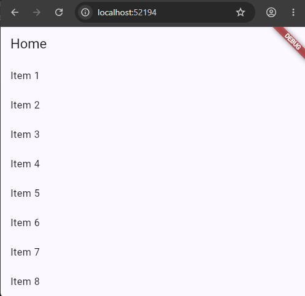

**Penjelasan**

Pada gambar di atas terlihat halaman utama (**HomePage**) aplikasi berhasil ditampilkan. Halaman ini berisi daftar item dari **Item 1** hingga **Item 8** yang dibuat menggunakan widget `ListView.builder`. Setiap item memiliki fungsi navigasi menuju halaman Detail ketika dipilih oleh pengguna. Hal ini menunjukkan bahwa route utama (`/`) telah berhasil dikonfigurasi menggunakan GoRouter.

---

### 4. Pengujian Navigasi ke Halaman Detail

Selanjutnya dilakukan pengujian dengan memilih salah satu item pada HomePage.

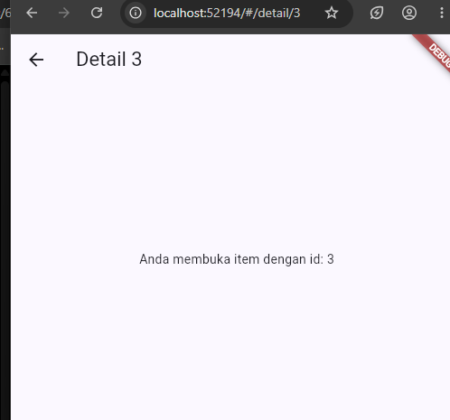

**Penjelasan**

Setelah pengguna memilih salah satu item pada HomePage, aplikasi berhasil berpindah ke **DetailPage** menggunakan GoRouter. Parameter `id` dikirim melalui path `/detail/:id` dan diterima oleh halaman Detail untuk ditampilkan pada layar. Hal ini membuktikan bahwa mekanisme navigasi beserta pengiriman parameter telah berjalan dengan baik.

---

### 5. Pengujian Tombol Kembali (Opsional)

Setelah berada pada halaman Detail, tombol **Back** ditekan untuk kembali ke halaman utama.

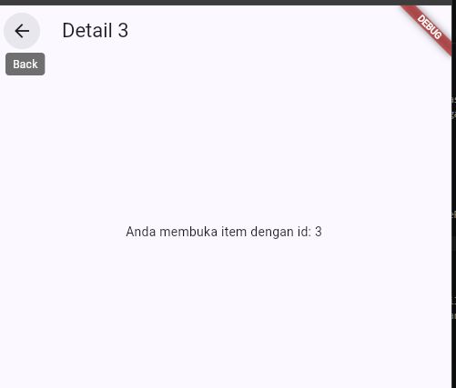

**Penjelasan**

Hasil pengujian menunjukkan bahwa tombol **Back** berfungsi dengan baik dan aplikasi kembali ke halaman HomePage. Hal ini menunjukkan bahwa alur navigasi aplikasi telah berjalan sesuai konfigurasi GoRouter.

---

## Hasil Praktikum

Berdasarkan hasil implementasi, aplikasi berhasil menggunakan **GoRouter** sebagai sistem navigasi. HomePage dapat ditampilkan sebagai halaman utama, sedangkan DetailPage dapat diakses melalui pemilihan salah satu item pada daftar. Parameter `id` berhasil dikirim dan ditampilkan pada halaman Detail. Selain itu, tombol Back juga berfungsi dengan baik sehingga proses navigasi antarhalaman berjalan sesuai yang diharapkan.

---

## Analisis Hasil

GoRouter memberikan kemudahan dalam mengelola navigasi aplikasi Flutter karena seluruh konfigurasi route berada dalam satu tempat. Penggunaan path parameter memudahkan pengiriman data antarhalaman tanpa perlu mengirim objek secara langsung. Dibandingkan dengan `Navigator.push()` dan `Navigator.pop()`, GoRouter memiliki struktur yang lebih rapi, mendukung deep link, serta lebih mudah dikembangkan ketika jumlah halaman aplikasi semakin banyak.

---

## Kesimpulan

Praktikum ini berhasil mengimplementasikan navigasi multi-page menggunakan GoRouter. HomePage berhasil menjadi halaman utama, DetailPage dapat menerima parameter `id`, dan proses navigasi antarhalaman berjalan dengan baik. Dengan demikian, GoRouter terbukti menjadi solusi navigasi yang lebih modern dan terstruktur pada pengembangan aplikasi Flutter.


# Praktikum 2 - State Management Menggunakan Riverpod

## Langkah Praktikum

### 1. Menambahkan Package Riverpod

Membuat project Flutter baru kemudian menambahkan package `flutter_riverpod` sebagai library untuk state management.

```bash
flutter create week3_todo
cd week3_todo
flutter pub add flutter_riverpod
```

---

### 2. Membuat Model dan Provider

Membuat model `Todo` beserta `TodoListNotifier` untuk mengelola daftar tugas. Seluruh perubahan data dilakukan menggunakan konsep **immutable**, sehingga Riverpod dapat mendeteksi perubahan state dan memperbarui tampilan secara otomatis.

---

### 3. Membuat Halaman Todo

Membuat halaman `TodoPage` menggunakan `ConsumerWidget`. Data dibaca menggunakan `ref.watch()`, sedangkan aksi seperti menambah, mengubah status, dan menghapus tugas dijalankan menggunakan `ref.read()`.

---

### 4. Menjalankan Aplikasi

Setelah seluruh implementasi selesai, aplikasi dijalankan menggunakan perintah berikut.

```bash
flutter run
```

Berikut merupakan tampilan awal aplikasi Todo.

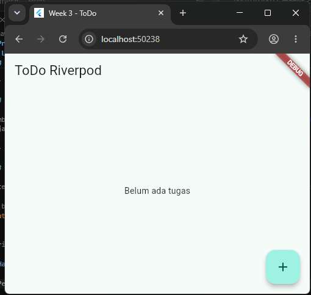

**Penjelasan**

Gambar di atas menunjukkan tampilan awal aplikasi **ToDo Riverpod**. Karena belum terdapat data tugas, aplikasi menampilkan pesan **"Belum ada tugas"** pada bagian tengah layar. Di bagian kanan bawah terdapat tombol **Floating Action Button (+)** yang digunakan untuk menambahkan tugas baru. Tampilan ini menunjukkan bahwa state awal aplikasi masih berupa daftar kosong (`[]`) dan aplikasi berhasil dijalankan menggunakan Riverpod.

---

### 5. Menambahkan Tugas

Pengguna menekan tombol **+**, kemudian memasukkan nama tugas dan menekan tombol **Tambah**.

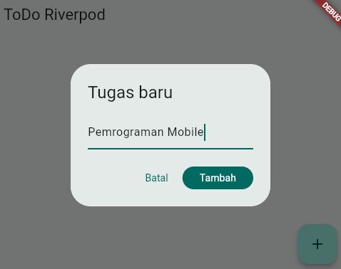

**Penjelasan**

Pada tahap ini pengguna memasukkan nama tugas melalui dialog input yang muncul setelah menekan tombol **Floating Action Button**. Setelah tombol **Tambah** ditekan, data akan dikirim ke `TodoListNotifier` dan disimpan ke dalam daftar tugas.

---

### 6. Menampilkan Daftar Tugas

Setelah tugas berhasil ditambahkan, aplikasi akan menampilkan daftar tugas.

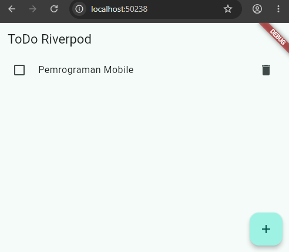

**Penjelasan**

Daftar tugas berhasil ditampilkan menggunakan `ListView.builder`. Data yang ditampilkan berasal dari provider Riverpod sehingga setiap perubahan state akan langsung memperbarui tampilan aplikasi tanpa menggunakan `setState()`.

---

### 7. Mengubah Status Tugas

Pengguna dapat menandai tugas sebagai selesai dengan mencentang checkbox.

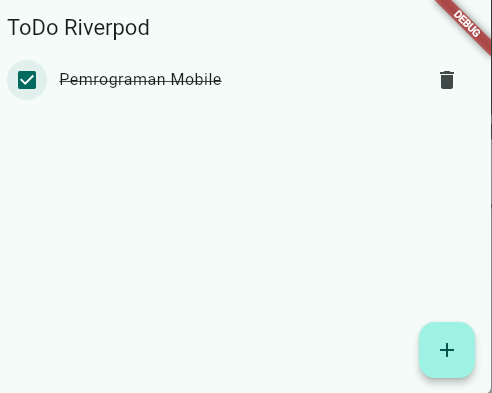

**Penjelasan**

Ketika checkbox dipilih, status tugas berubah menjadi selesai (`done = true`). Riverpod akan memperbarui state dan tampilan secara otomatis. Tugas yang telah selesai ditampilkan dengan efek **coret (line-through)** sebagai penanda bahwa tugas telah diselesaikan.

---

### 8. Menghapus Tugas

Pengguna dapat menghapus tugas menggunakan ikon **Delete**.

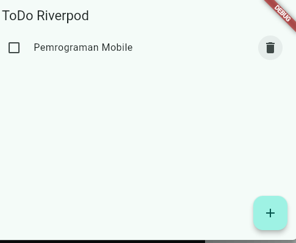

**Penjelasan**

Fitur hapus tugas berjalan dengan baik. Setelah tombol **Delete** ditekan, data akan dihapus dari provider dan daftar tugas pada tampilan akan diperbarui secara otomatis tanpa perlu melakukan refresh halaman.

---

## Hasil Praktikum

Berdasarkan hasil implementasi, aplikasi Todo berhasil menggunakan **Riverpod** sebagai state management. Seluruh fitur utama, seperti menambah tugas, menampilkan daftar tugas, mengubah status tugas menjadi selesai, dan menghapus tugas, berjalan dengan baik. Perubahan data langsung diperbarui pada antarmuka aplikasi tanpa menggunakan `setState()`.

---

## Analisis Hasil

Riverpod mempermudah pengelolaan state dengan memisahkan logika bisnis dari tampilan aplikasi. Penggunaan `NotifierProvider` membuat seluruh perubahan data terpusat sehingga kode menjadi lebih rapi dan mudah dipelihara. Selain itu, `ref.watch()` memungkinkan tampilan selalu sinkron dengan state terbaru, sedangkan `ref.read()` digunakan untuk menjalankan aksi tanpa menyebabkan rebuild yang tidak diperlukan. Pendekatan ini lebih efektif dibandingkan menggunakan `setState()` pada aplikasi yang memiliki banyak halaman atau state yang kompleks.

# Praktikum 3 - AsyncValue: Loading, Error, Success

## Langkah Praktikum

### 1. Mengubah Provider Menjadi AsyncNotifier

Pada praktikum ini, provider diubah dari `NotifierProvider` menjadi `AsyncNotifierProvider`. Perubahan ini bertujuan agar aplikasi mampu menangani proses asynchronous seperti mengambil data dari server.

Contoh implementasi:

```dart
class ProductsNotifier extends AsyncNotifier<List<String>> {
  @override
  Future<List<String>> build() async {
    await Future.delayed(const Duration(seconds: 2));

    return [
      'Keyboard',
      'Mouse',
      'Monitor',
      'Headset',
    ];
  }
}

final productsProvider =
    AsyncNotifierProvider<ProductsNotifier, List<String>>(
      ProductsNotifier.new,
    );
```

**Penjelasan**

`AsyncNotifier` digunakan untuk mengelola data asynchronous. Pada contoh di atas, `Future.delayed()` digunakan untuk mensimulasikan proses pengambilan data dari server selama 2 detik sebelum daftar produk ditampilkan.

---

### 2. Menampilkan State Menggunakan AsyncValue

Selanjutnya halaman aplikasi diubah agar dapat menangani tiga kondisi, yaitu **loading**, **error**, dan **success** menggunakan method `when()`.

```dart
productsAsync.when(
  loading: () => const Center(
    child: CircularProgressIndicator(),
  ),

  error: (err, stack) => Center(
    child: Text("Gagal memuat data"),
  ),

  data: (products) => ListView.builder(
    itemCount: products.length,
    itemBuilder: (context, index) {
      return ListTile(
        title: Text(products[index]),
      );
    },
  ),
)
```

**Penjelasan**

Method `when()` akan menentukan tampilan sesuai kondisi provider. Ketika data sedang dimuat akan muncul indikator loading, ketika terjadi kesalahan akan muncul pesan error, sedangkan ketika data berhasil diperoleh akan ditampilkan daftar produk.

---

### 3. Pengujian State Loading

Jalankan aplikasi menggunakan perintah berikut.

```bash
flutter run
```

Pada saat aplikasi pertama kali dijalankan, akan muncul tampilan loading.

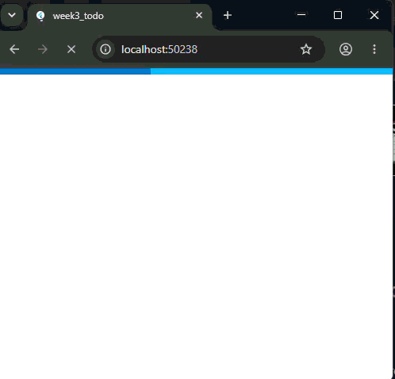

**Penjelasan**

Aplikasi menampilkan widget `CircularProgressIndicator` sebagai indikator bahwa proses pengambilan data sedang berlangsung. Setelah proses selesai, state akan berubah menjadi success.

---

### 4. Pengujian State Error

Untuk menguji kondisi error, ubah fungsi `build()` menjadi:

```dart
@override
Future<List<String>> build() async {
  throw Exception('Gagal terhubung ke server');
}
```

Kemudian jalankan kembali aplikasi.

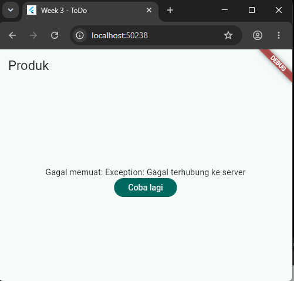

**Penjelasan**

Saat terjadi exception, aplikasi tidak mengalami crash. Riverpod mengubah exception tersebut menjadi `AsyncError` sehingga pengguna mendapatkan informasi bahwa proses pengambilan data gagal. Selain itu, aplikasi menyediakan tombol **Coba Lagi** untuk menjalankan ulang provider.

---

### 5. Pengujian State Success

Setelah selesai menguji error, kembalikan fungsi `build()` seperti semula.

```dart
@override
Future<List<String>> build() async {
  await Future.delayed(const Duration(seconds: 2));

  return [
    'Keyboard',
    'Mouse',
    'Monitor',
    'Headset',
  ];
}
```

Kemudian tekan tombol **Coba Lagi** atau jalankan ulang aplikasi.

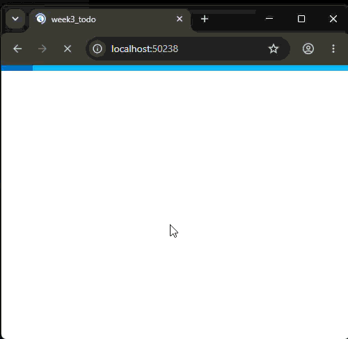

**Penjelasan**

Data berhasil dimuat dan aplikasi menampilkan daftar produk pada layar. Hal ini menunjukkan bahwa provider berhasil menyelesaikan proses asynchronous dan state berubah menjadi **success**.

---

### 6. Refleksi

Menampilkan data lama (*stale data*) selama proses refresh sering kali lebih baik dibandingkan mengosongkan layar. Dengan cara ini pengguna masih dapat melihat informasi sebelumnya sambil menunggu data terbaru dimuat. Pola ini umum digunakan pada aplikasi berita, media sosial, e-commerce, maupun dashboard agar pengalaman pengguna tetap nyaman dan tidak terganggu.

---

## Hasil Praktikum

Berdasarkan hasil implementasi, aplikasi berhasil menangani tiga kondisi asynchronous menggunakan `AsyncValue`, yaitu **loading**, **error**, dan **success**. Perubahan state dapat ditampilkan secara otomatis tanpa perlu membuat variabel `isLoading` atau `hasError` secara manual.

---

## Analisis Hasil

Penggunaan `AsyncNotifier` dan `AsyncValue` membuat pengelolaan data asynchronous menjadi lebih sederhana dan terstruktur. Method `when()` mempermudah pengembang dalam menentukan tampilan berdasarkan kondisi data sehingga kode menjadi lebih bersih dan mudah dipelihara. Selain itu, mekanisme `ref.invalidate()` memungkinkan provider dijalankan kembali ketika pengguna menekan tombol **Coba Lagi**, sehingga proses refresh data dapat dilakukan dengan mudah.

---

## Kesimpulan

Praktikum ini berhasil mengimplementasikan `AsyncNotifier` dan `AsyncValue` pada Flutter menggunakan Riverpod. Aplikasi mampu menampilkan indikator loading saat data sedang diproses, menampilkan pesan error ketika terjadi kegagalan, serta menampilkan data ketika proses berhasil. Pendekatan ini membuat aplikasi lebih responsif, mudah dikembangkan, dan memberikan pengalaman pengguna yang lebih baik.

# Praktikum 4 - AI Challenge

## Langkah Praktikum

### 1. Membuat Prompt AI

Pada praktikum ini digunakan AI Coding Assistant (ChatGPT) untuk membantu menghasilkan kode Flutter yang menerapkan **Riverpod** dengan **AsyncNotifierProvider**.

Prompt yang digunakan adalah sebagai berikut.

```text
Buatkan aplikasi Flutter menggunakan flutter_riverpod.

Kriteria:
- Menggunakan ConsumerWidget.
- Menggunakan AsyncNotifierProvider.
- Menampilkan tiga state AsyncValue (Loading, Error, Success).
- Loading menggunakan CircularProgressIndicator.
- Error menampilkan pesan kesalahan dan tombol Coba Lagi.
- Success menampilkan daftar statistik menggunakan ListView.
- Berikan komentar pada setiap bagian kode.
```

**Penjelasan**

AI menghasilkan dua komponen utama yaitu **StatsPage** sebagai halaman tampilan dan **StatsNotifier** sebagai provider yang mengelola state asynchronous. Selanjutnya kode diverifikasi dan diuji agar sesuai dengan materi praktikum.

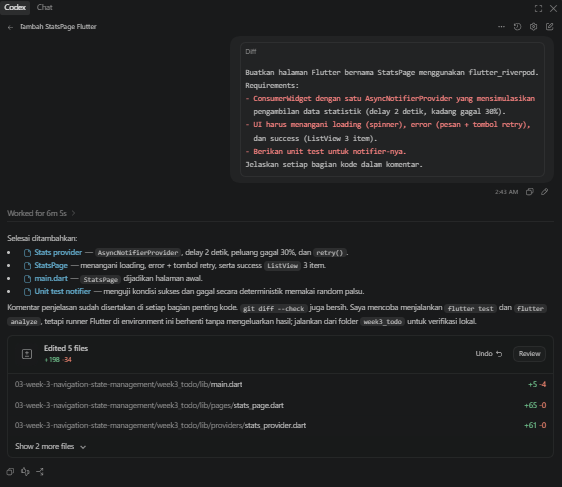
---

### 2. Implementasi Halaman Statistik

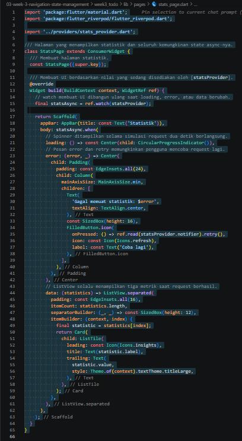

**Penjelasan**

Halaman `StatsPage` dibuat menggunakan `ConsumerWidget`. Data diperoleh dari `statsProvider` menggunakan `ref.watch()`. Tampilan aplikasi dibedakan menjadi tiga kondisi menggunakan `AsyncValue.when()`, yaitu **Loading**, **Error**, dan **Success**.

---

### 3. Implementasi StatsProvider

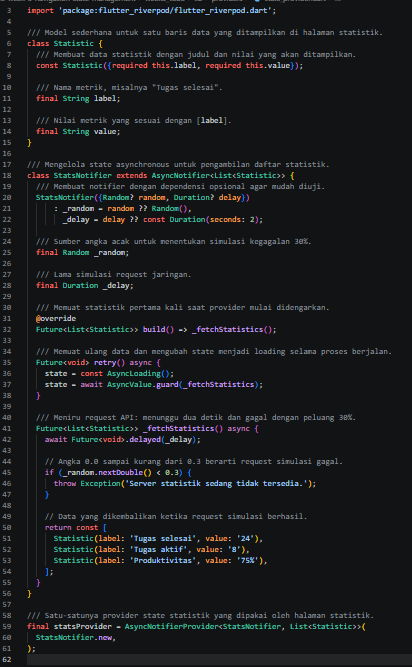

**Penjelasan**

`StatsNotifier` menggunakan `AsyncNotifier` untuk mengelola proses asynchronous. Fungsi `_fetchStatistics()` mensimulasikan proses pengambilan data dari server selama dua detik. Selain itu terdapat kemungkinan kegagalan sebesar **30%**, sehingga aplikasi dapat menampilkan kondisi **Error** dan menyediakan fitur **Retry**.

---

## AI Verification Checklist

### 1. Verifikasi Penggunaan Immutable State

**Hasil:** ✅ Lulus

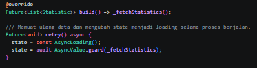

**Penjelasan**

Berdasarkan hasil pemeriksaan, perubahan state tidak dilakukan secara langsung (mutable). `StatsNotifier` menggunakan `AsyncNotifier` untuk mengelola state asynchronous, sedangkan perubahan state dilakukan melalui assignment seperti:

```dart
state = const AsyncLoading();
state = await AsyncValue.guard(_fetchStatistics);
```

Tidak ditemukan penggunaan mutasi data seperti `state.add()`, `state.remove()`, atau perubahan list secara langsung. Pendekatan ini sesuai dengan konsep **immutable state** yang direkomendasikan oleh Riverpod sehingga setiap perubahan state dapat dideteksi dengan baik dan antarmuka aplikasi diperbarui secara otomatis.

---

### 2. Verifikasi Penggunaan `ref.watch()` dan `ref.read()`

**Hasil:** ✅ Lulus

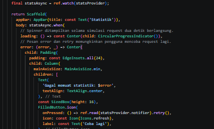

**Penjelasan**

Hasil verifikasi menunjukkan bahwa `ref.watch(statsProvider)` digunakan di dalam method `build()` untuk mengamati perubahan state sehingga tampilan aplikasi akan diperbarui secara otomatis ketika state berubah.

Selain itu, `ref.read(statsProvider.notifier).retry()` digunakan pada callback tombol **Coba Lagi**. Penggunaan `ref.read()` pada callback sudah sesuai dengan praktik terbaik Riverpod karena hanya digunakan untuk menjalankan aksi tanpa menyebabkan widget melakukan rebuild yang tidak diperlukan.

---

### 3. Verifikasi AsyncValue

**Hasil:** ✅ Lulus

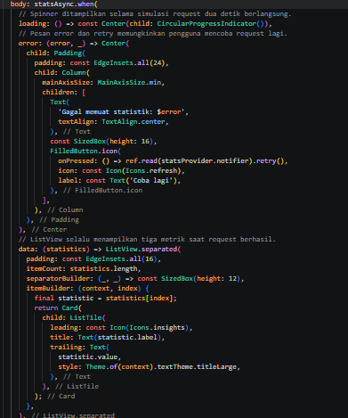

**Penjelasan**

Berdasarkan hasil pengujian, aplikasi telah menangani seluruh kondisi `AsyncValue` dengan baik menggunakan method `when()`. Tiga state yang berhasil diimplementasikan yaitu:

- **Loading**, ditampilkan menggunakan `CircularProgressIndicator`.
- **Error**, ditampilkan berupa pesan kesalahan beserta tombol **Coba Lagi**.
- **Success**, ditampilkan dalam bentuk daftar statistik menggunakan `ListView`.

Implementasi tersebut membuat aplikasi mampu memberikan umpan balik kepada pengguna sesuai dengan kondisi proses pengambilan data.

---

### 4. Verifikasi Provider

**Hasil:** ✅ Lulus

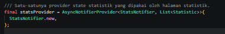

**Penjelasan**

Provider telah dideklarasikan menggunakan tipe yang eksplisit yaitu `AsyncNotifierProvider<StatsNotifier, List<Statistic>>`. Pendeklarasian ini membuat tipe data yang digunakan menjadi lebih jelas dan memudahkan proses pengembangan maupun pemeliharaan kode. Selain itu, hanya terdapat satu provider untuk mengelola data statistik sehingga tidak ditemukan duplikasi provider.

Tidak ditemukan provider yang memiliki fungsi sama sehingga tidak terjadi duplikasi.

---

### 5. Verifikasi API Riverpod

**Hasil:** ✅ Lulus

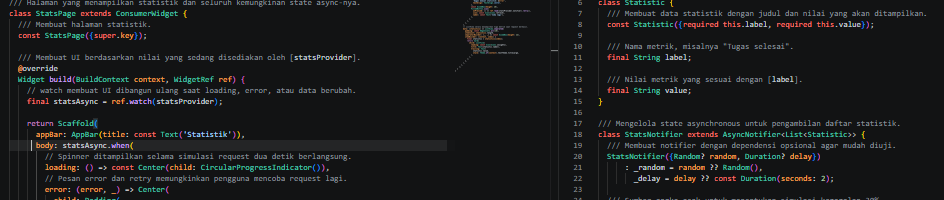

**Penjelasan**

Hasil pemeriksaan menunjukkan bahwa implementasi menggunakan API Riverpod versi terbaru, yaitu `ConsumerWidget`, `AsyncNotifier`, dan `AsyncNotifierProvider`. Tidak ditemukan penggunaan API lama seperti `StateProvider`, `StateNotifierProvider`, maupun `Consumer` bertingkat yang tidak diperlukan. Dengan demikian, implementasi telah mengikuti praktik terbaik yang direkomendasikan pada Riverpod versi terbaru.

---

### 6. Pengujian State Loading

Jalankan aplikasi menggunakan perintah berikut.

```bash
flutter run
```

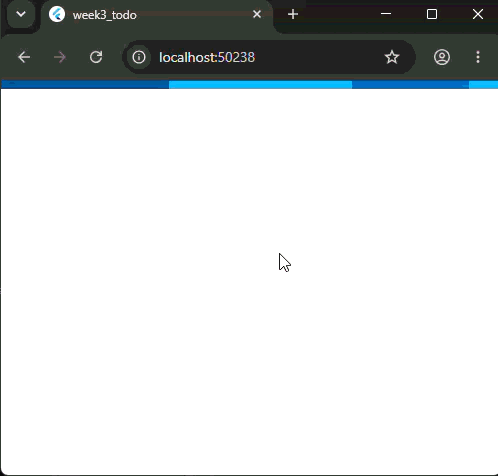

**Penjelasan**

Saat aplikasi pertama kali dijalankan, provider membutuhkan waktu sekitar dua detik untuk mensimulasikan proses pengambilan data. Selama proses tersebut, aplikasi menampilkan widget **CircularProgressIndicator** sebagai indikator bahwa data sedang dimuat. Setelah proses selesai, state akan berubah menjadi **Success** dan data statistik akan ditampilkan.

---

### 7. Pengujian State Success

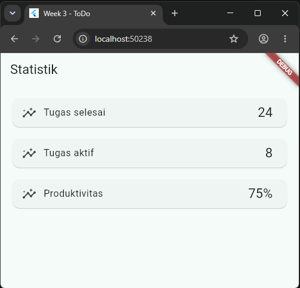

**Penjelasan**

Setelah proses pengambilan data berhasil diselesaikan, aplikasi menampilkan daftar statistik dalam bentuk **ListView**. Data yang ditampilkan terdiri dari jumlah tugas selesai, tugas aktif, dan tingkat produktivitas. Hal ini menunjukkan bahwa provider berhasil mengembalikan data dan state berubah menjadi **Success**.

---

### 8. Pengujian State Error

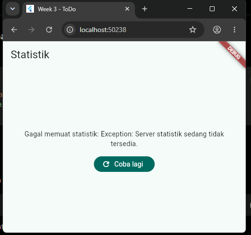

**Penjelasan**

Untuk menguji kondisi **Error**, provider dibuat melempar `Exception` sehingga proses pengambilan data gagal. Aplikasi kemudian menampilkan pesan kesalahan beserta tombol **Coba Lagi**. Tombol tersebut memanggil method `retry()` untuk menjalankan kembali proses pengambilan data tanpa perlu menutup aplikasi.

---

### 9. Pengujian Flutter Analyze

Jalankan perintah berikut.

```bash
flutter analyze
```

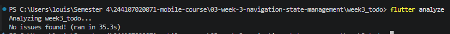

**Penjelasan**

Perintah `flutter analyze` digunakan untuk memeriksa kualitas kode program. Hasil pengujian menunjukkan bahwa aplikasi dapat dianalisis tanpa ditemukan error maupun warning sehingga implementasi telah sesuai dengan standar Flutter.

---

### 10. Pengujian Flutter Test

Jalankan perintah berikut.

```bash
flutter test
```

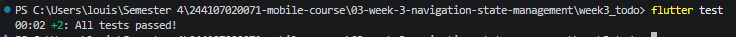

**Penjelasan**

Perintah `flutter test` digunakan untuk menjalankan pengujian pada aplikasi. Hasil pengujian menunjukkan bahwa seluruh test berhasil dijalankan tanpa kegagalan sehingga implementasi aplikasi dapat berjalan dengan baik.

---

## Hasil Praktikum

Berdasarkan hasil implementasi dan pengujian, aplikasi berhasil menerapkan **Riverpod** menggunakan **AsyncNotifierProvider** sebagai state management. Aplikasi mampu menangani tiga kondisi asynchronous yaitu **Loading**, **Error**, dan **Success**. Selain itu, fitur **Retry** memungkinkan pengguna melakukan pengambilan data kembali ketika terjadi kegagalan.

---

## Analisis Hasil

Penggunaan AI Coding Assistant membantu mempercepat proses pembuatan struktur dasar aplikasi Flutter. Kode yang dihasilkan telah menerapkan `ConsumerWidget`, `AsyncNotifier`, `AsyncNotifierProvider`, serta `AsyncValue.when()` untuk menangani seluruh kondisi asynchronous. Setelah dilakukan proses verifikasi dan pengujian, aplikasi dapat berjalan sesuai dengan kebutuhan praktikum serta mengikuti praktik terbaik Riverpod versi terbaru.

---

## Kesimpulan

Praktikum AI Challenge berhasil menunjukkan bahwa AI dapat dimanfaatkan untuk membantu menghasilkan kode Flutter dengan lebih cepat. Setelah dilakukan proses verifikasi, perbaikan, dan pengujian, aplikasi berhasil menangani seluruh kondisi asynchronous dengan baik, yaitu **Loading**, **Error**, dan **Success**, serta menyediakan mekanisme **Retry** untuk meningkatkan pengalaman pengguna.

# Praktikum 5 - Refactoring dan Testing

## Langkah Praktikum

### 1. Melakukan Refactoring Kode

Pada tahap ini dilakukan refactoring untuk meningkatkan keterbacaan dan struktur kode aplikasi. Widget dipisahkan sesuai fungsinya, logika state tetap dikelola oleh Riverpod, serta halaman statistik ditambahkan ke dalam aplikasi.

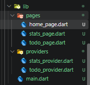

**Penjelasan**

Refactoring dilakukan tanpa mengubah fungsionalitas aplikasi. Struktur kode menjadi lebih rapi karena logika bisnis berada pada provider, sedangkan tampilan hanya bertugas menampilkan data. Dengan demikian kode menjadi lebih mudah dipelihara dan dikembangkan.

---

### 2. Integrasi Halaman Statistik

Halaman **StatsPage** berhasil diintegrasikan ke dalam aplikasi sehingga dapat diakses melalui navigasi yang telah dibuat.


**Penjelasan**

Halaman statistik berhasil ditambahkan ke dalam aplikasi. Halaman ini menggunakan `ConsumerWidget` dan `statsProvider` untuk menampilkan data secara asynchronous menggunakan tiga kondisi yaitu **Loading**, **Error**, dan **Success**.

---

### 3. Menjalankan Flutter Analyze

Kode diperiksa menggunakan perintah berikut.

```bash
flutter analyze
```


**Penjelasan**

Perintah `flutter analyze` digunakan untuk memeriksa kualitas kode. Hasil analisis menunjukkan bahwa seluruh source code berhasil dianalisis tanpa ditemukan error maupun warning sehingga kode telah memenuhi standar Flutter.

---

### 4. Menjalankan Flutter Test

Pengujian aplikasi dilakukan menggunakan perintah berikut.

```bash
flutter test
```


**Penjelasan**

Pengujian dilakukan untuk memastikan implementasi provider dan halaman statistik berjalan sesuai harapan. Seluruh test berhasil dijalankan sehingga aplikasi dinyatakan bekerja dengan baik.

---

## Checklist Verifikasi

| No | Pengujian | Hasil |
|----|-----------|:----:|
| 1 | Navigasi GoRouter berjalan dengan baik | ✅ |
| 2 | Riverpod mengelola state aplikasi | ✅ |
| 3 | AsyncValue menangani Loading, Error, Success | ✅ |
| 4 | Flutter Analyze tanpa error/warning | ✅ |
| 5 | Flutter Test berhasil dijalankan | ✅ |

---

## Hasil Praktikum

Refactoring berhasil meningkatkan struktur aplikasi tanpa mengubah fungsionalitas. Seluruh logika state berhasil dipisahkan dari tampilan menggunakan Riverpod sehingga kode menjadi lebih bersih dan mudah dipelihara. Selain itu, seluruh pengujian menggunakan `flutter analyze` dan `flutter test` berhasil dijalankan dengan baik.

---

## Analisis Hasil

Refactoring merupakan langkah penting dalam pengembangan aplikasi karena membantu meningkatkan kualitas kode tanpa mengubah perilaku program. Dengan memisahkan logika bisnis ke dalam provider dan menggunakan `ConsumerWidget` pada tampilan, struktur aplikasi menjadi lebih modular. Penggunaan `flutter analyze` membantu menemukan kesalahan sejak awal, sedangkan `flutter test` memastikan perubahan yang dilakukan tidak merusak fungsi aplikasi.

---

## Kesimpulan

Praktikum Refactoring dan Testing berhasil meningkatkan kualitas aplikasi Flutter yang telah dibuat. Struktur kode menjadi lebih rapi, mudah dipahami, dan mudah dikembangkan. Selain itu, proses analisis serta pengujian menunjukkan bahwa aplikasi berjalan dengan baik dan memenuhi praktik pengembangan Flutter yang direkomendasikan.

---

## Implementasi Refactoring dan Testing

### 1. Pemisahan Widget `TodoTile`

Widget untuk satu baris tugas dipindahkan ke file `week3_todo/lib/widgets/todo_tile.dart`. Widget ini menerima objek `Todo`, menampilkan `CheckboxListTile`, dan memanggil `todoListProvider.notifier.toggle()` saat checkbox ditekan. Dengan pemisahan ini, method `build()` pada `TodoPage` hanya bertanggung jawab pada daftar tugas, keadaan kosong, dan tombol tambah.

### 2. Provider Turunan untuk Filter Tugas

Provider utama `todoListProvider` menyimpan seluruh daftar tugas. Filter tugas yang belum selesai diekstrak ke `incompleteTodosProvider`.

```dart
final incompleteTodosProvider = Provider<List<Todo>>((ref) {
  final todos = ref.watch(todoListProvider);
  return todos.where((todo) => !todo.isCompleted).toList(growable: false);
});
```

`TodoPage` cukup melakukan `ref.watch(incompleteTodosProvider)`, sehingga logika filter tidak bercampur dengan kode UI. Ketika sebuah tugas ditandai selesai, state pada provider utama berubah dan daftar pada halaman otomatis diperbarui.

### 3. Integrasi GoRouter dan NavigationBar

Aplikasi menggunakan `MaterialApp.router` dan `GoRouter` dengan dua rute utama:

| Path | Halaman | Fungsi |
|---|---|---|
| `/` | `TodoPage` | Menampilkan serta menambah tugas. |
| `/stats` | `StatsPage` | Menampilkan statistik asynchronous. |

Kedua rute berada dalam `ShellRoute`. `HomePage` berfungsi sebagai shell yang menyediakan `NavigationBar`, sehingga pengguna dapat berpindah antara daftar ToDo dan statistik tanpa membuat ulang `ProviderScope`. Akibatnya state daftar tugas tetap bertahan saat halaman berpindah.

### 4. Pengujian Widget dan Notifier

Widget test pada `week3_todo/test/todo_page_test.dart` memeriksa alur penambahan tugas dari UI:

1. Aplikasi dimulai dengan teks `Belum ada tugas`.
2. Pengguna menekan tombol tambah, memasukkan `Kerjakan PR minggu 3`, lalu memilih tombol `Tambah`.
3. Test memastikan judul tugas baru muncul pada layar.

Unit test pada `week3_todo/test/stats_notifier_test.dart` memeriksa dua hasil `StatsNotifier`: data sukses berisi tiga statistik dan request gagal menghasilkan exception. Random palsu dipakai agar kedua kondisi dapat diuji secara deterministik tanpa menunggu simulasi jaringan.

### 5. Hasil Verifikasi

Perintah berikut dijalankan dari folder `week3_todo`:

```bash
flutter analyze
flutter test
```

Hasil verifikasi:

| Pemeriksaan | Hasil |
|---|:---:|
| `flutter analyze` | Tidak ditemukan issue |
| `flutter test` | 3 test lulus |
| State statistik | Loading, error, dan success ditangani oleh `AsyncValue.when()` |
| Navigasi | Rute `/` dan `/stats` dapat diakses melalui GoRouter |
