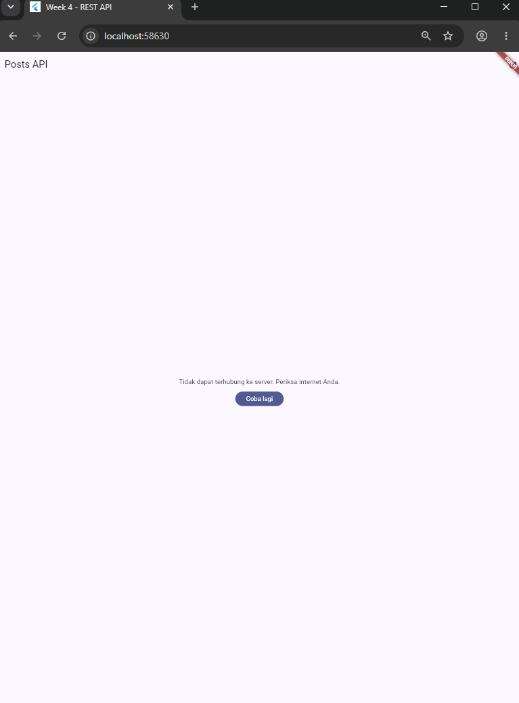

# Week 4 - Networking & REST API

## Deskripsi

Pada praktikum minggu ke-4 ini dipelajari bagaimana aplikasi Flutter berkomunikasi dengan server melalui **REST API** menggunakan protokol **HTTP**. Praktikum memanfaatkan package **Dio** sebagai HTTP client dan **Riverpod** sebagai state management. Selain itu, diterapkan **Repository Pattern** agar pemisahan antara UI dan proses pengambilan data menjadi lebih terstruktur, sehingga aplikasi lebih mudah dikembangkan, diuji, dan dipelihara.

REST API yang digunakan adalah **JSONPlaceholder**, yaitu layanan API gratis yang menyediakan data dummy untuk kebutuhan pembelajaran.

---

# Tujuan

Setelah menyelesaikan praktikum ini, mahasiswa mampu:

* Memahami konsep HTTP, REST API, dan JSON.
* Melakukan parsing JSON ke dalam Model Dart menggunakan `fromJson()` dan `toJson()`.
* Menggunakan package Dio sebagai HTTP client.
* Mengimplementasikan Repository Pattern.
* Menggunakan Riverpod dengan `AsyncNotifier`.
* Menampilkan state **Loading**, **Success**, **Empty**, dan **Error**.
* Mengimplementasikan fitur Refresh Data.
* Menangani error jaringan menggunakan pesan yang ramah bagi pengguna.

---

# Persiapan

Sebelum memulai praktikum, pastikan telah tersedia:

## Software

* Flutter SDK
* Dart SDK
* Visual Studio Code
* Android Studio / Emulator Android
* Git

## Package

Tambahkan dependency berikut:

```bash
flutter pub add dio
flutter pub add flutter_riverpod
```

## REST API

API yang digunakan:

```text
https://jsonplaceholder.typicode.com
```

Endpoint:

```text
GET /posts
```

---

# Konsep Dasar

## HTTP

HTTP (HyperText Transfer Protocol) merupakan protokol komunikasi antara client dan server.

Method HTTP yang digunakan:

| Method      | Fungsi         |
| ----------- | -------------- |
| GET         | Mengambil data |
| POST        | Menambah data  |
| PUT / PATCH | Mengubah data  |
| DELETE      | Menghapus data |

Status Code penting:

| Status Code | Arti                  |
| ----------- | --------------------- |
| 200         | OK                    |
| 201         | Created               |
| 400         | Bad Request           |
| 401         | Unauthorized          |
| 404         | Not Found             |
| 500         | Internal Server Error |

---

## REST API

REST (Representational State Transfer) merupakan arsitektur yang digunakan untuk menyediakan layanan web melalui endpoint HTTP.

Contoh endpoint:

```text
GET https://jsonplaceholder.typicode.com/posts
```

---

## JSON

JSON (JavaScript Object Notation) adalah format pertukaran data yang paling umum digunakan pada REST API.

Contoh data JSON:

```json
{
  "userId": 1,
  "id": 1,
  "title": "sunt aut facere...",
  "body": "quia et suscipit..."
}
```

Data JSON kemudian diubah menjadi objek Dart menggunakan:

* `fromJson()`
* `toJson()`

---

## Repository Pattern

Arsitektur aplikasi pada praktikum ini:

```text
UI
│
▼
Riverpod Provider
│
▼
Repository
│
▼
Dio
│
▼
REST API
```

Keuntungan Repository Pattern:

* UI tidak berhubungan langsung dengan API.
* Networking terpusat.
* Mudah diuji.
* Mudah dikembangkan.

---

# 🛠 Praktikum 1 - Dio dan Model Data

## Tujuan

Membuat model data, menghubungkan aplikasi dengan REST API menggunakan Dio, serta menerapkan Repository Pattern.

## Langkah Praktikum

### 1. Membuat Project

```bash
flutter create week4_api
cd week4_api
flutter pub add dio flutter_riverpod
```

### 2. Membuat Struktur Folder

```text
lib/
├── main.dart
├── data/
│   ├── api_client.dart
│   ├── models/
│   │   └── post.dart
│   └── repositories/
│       └── post_repository.dart
└── pages/
    └── post_list_page.dart
```

### 3. Membuat Model Post

Model memiliki atribut:

* userId
* id
* title
* body

Model menggunakan:

* `factory Post.fromJson()`
* `toJson()`

untuk mengubah JSON menjadi objek Dart dan sebaliknya.

### 4. Konfigurasi Dio

Konfigurasi dilakukan pada `api_client.dart`.

Fitur yang digunakan:

* Base URL
* Connect Timeout
* Receive Timeout
* Default Header
* LogInterceptor

### 5. Membuat Repository

Repository bertugas:

* Mengambil data dari REST API.
* Mengubah JSON menjadi `List<Post>`.
* Mengembalikan data ke Provider.

Repository tidak memiliki kode UI sehingga mengikuti prinsip **Separation of Concerns**.

---

# 🛠 Praktikum 2 - Provider dan Error Handling

## Tujuan

Menghubungkan Repository dengan Riverpod serta menangani berbagai kondisi jaringan menggunakan `AsyncNotifier`.

## Implementasi

### Provider

Digunakan beberapa provider:

* `dioProvider`
* `postRepositoryProvider`
* `postListProvider`

Provider bertugas mengambil data dari Repository dan menyediakan state kepada UI.

---

### State Management

State yang ditangani menggunakan `AsyncValue` meliputi:

* Loading
* Success
* Empty
* Error

---

### Friendly Error Message

Error teknis dari Dio diubah menjadi pesan yang mudah dipahami pengguna.

Contoh:

| Kondisi            | Pesan                            |
| ------------------ | -------------------------------- |
| Timeout            | Koneksi lambat atau timeout.     |
| Tidak ada internet | Tidak dapat terhubung ke server. |
| 404                | Data tidak ditemukan.            |
| 401 / 403          | Akses ditolak.                   |
| Server Error       | Server bermasalah.               |

---

### Tampilan UI

UI dibuat menggunakan `ConsumerWidget` dan `AsyncValue.when()` sehingga dapat menampilkan:

* Loading Indicator
* Daftar Post
* Pesan Error
* Empty State

Selain itu ditambahkan:

* Tombol Refresh
* Pull to Refresh (`RefreshIndicator`)
* Tombol **Coba Lagi** ketika terjadi error.

---

# Uji tiga skenario error

## Skenario 1 - Internet Normal

**Hasil yang diharapkan:**

* Loading muncul.
* Data berhasil diambil.
* 100 post ditampilkan.

**Screenshot**


Pada pengujian ini aplikasi dijalankan dengan koneksi internet yang aktif. Saat pertama kali dijalankan, aplikasi menampilkan **loading indicator (CircularProgressIndicator)** sebagai tanda bahwa proses pengambilan data dari REST API sedang berlangsung. Setelah request berhasil diproses oleh server, aplikasi menampilkan **100 data post** yang diperoleh dari endpoint **JSONPlaceholder** dalam bentuk daftar (`ListView`). Hal ini menunjukkan bahwa konfigurasi **Dio**, **Repository Pattern**, dan **Riverpod AsyncNotifier** telah berjalan dengan baik sehingga proses komunikasi antara aplikasi dan REST API berhasil dilakukan tanpa kendala.

---

## Skenario 2 - Internet Dimatikan

**Hasil yang diharapkan:**

* Muncul pesan error.
* Tombol **Coba Lagi** tampil.
* Setelah internet aktif kembali, data dapat dimuat ulang.

**Screenshot**


Pada pengujian ini, koneksi internet pada perangkat dimatikan kemudian tombol **Refresh** ditekan untuk mengambil data kembali dari REST API. Karena perangkat tidak dapat terhubung ke server, proses request gagal dan menghasilkan **DioException** yang kemudian ditangani oleh **Riverpod AsyncNotifier**. Aplikasi tidak mengalami crash, melainkan menampilkan pesan kesalahan yang ramah bagi pengguna, yaitu *"Tidak dapat terhubung ke server. Periksa internet Anda."* beserta tombol **Coba Lagi**. Setelah koneksi internet diaktifkan kembali dan tombol **Coba Lagi** ditekan, aplikasi berhasil mengambil data dan menampilkannya kembali. Hal ini menunjukkan bahwa mekanisme **error handling** telah berjalan dengan baik serta mampu menangani kondisi kehilangan koneksi internet tanpa mengganggu pengalaman pengguna.

## Skenario 3 - Base URL Salah

**Hasil yang diharapkan:**

* Muncul error koneksi.
* Aplikasi tidak crash.
* Setelah URL diperbaiki, aplikasi berjalan normal.

**Screenshot**




# 📌 Kesimpulan

Pada praktikum ini berhasil dibuat aplikasi Flutter yang mengambil data dari REST API menggunakan **Dio** dan **Riverpod** dengan arsitektur **Repository Pattern**. Aplikasi mampu menangani berbagai kondisi seperti **Loading**, **Success**, **Empty**, dan **Error** melalui `AsyncValue`, serta memberikan pesan kesalahan yang mudah dipahami pengguna. Implementasi ini menghasilkan kode yang lebih terstruktur, mudah dipelihara, dan siap dikembangkan untuk aplikasi yang lebih kompleks.

# 🛠 Praktikum 3 - Pagination Dasar

## Tujuan

Pada praktikum ini mahasiswa mempelajari cara mengimplementasikan **pagination** pada aplikasi Flutter menggunakan REST API. Pagination digunakan agar data tidak diambil sekaligus dalam jumlah besar, tetapi dimuat secara bertahap setiap pengguna melakukan scroll ke bagian bawah halaman (infinite scroll). Dengan cara ini penggunaan memori menjadi lebih efisien dan pengalaman pengguna menjadi lebih baik.

---

# Konsep Pagination

Pagination adalah teknik membagi data menjadi beberapa halaman. API JSONPlaceholder menyediakan parameter query:

```text
?_page=N&_limit=M
```

Contoh:

```text
https://jsonplaceholder.typicode.com/posts?_page=1&_limit=10
```

Artinya:

- `_page=1` → mengambil halaman pertama.
- `_limit=10` → setiap halaman berisi 10 data.

Ketika pengguna melakukan scroll hingga mendekati bagian bawah, aplikasi akan meminta halaman berikutnya tanpa menghapus data yang sudah ditampilkan sebelumnya (**Infinite Scroll**).

---

# Implementasi

Praktikum ini terdiri dari beberapa bagian, yaitu:

- Menambahkan method `fetchPostsPage()` pada `PostRepository`.
- Membuat `PagedPostsState` untuk menyimpan informasi halaman.
- Membuat `PagedPostsNotifier`.
- Membuat tampilan `PagedPostPage`.
- Menggunakan `ScrollController` untuk mendeteksi posisi scroll.
- Menampilkan loading kecil di bagian bawah saat halaman berikutnya sedang dimuat.

---

# Pengujian

## Langkah Pengujian

1. Jalankan aplikasi.
2. Pastikan perangkat terhubung ke internet.
3. Halaman pertama (10 data) akan dimuat secara otomatis.
4. Scroll ke bagian paling bawah.
5. Amati bahwa aplikasi menampilkan loading indicator.
6. Setelah loading selesai, data berikutnya ditambahkan ke daftar tanpa menghapus data sebelumnya.
7. Ulangi proses hingga seluruh data berhasil dimuat.

---

## Hasil yang Diharapkan

- Halaman pertama berisi 10 data berhasil ditampilkan.
- Saat pengguna melakukan scroll hingga mendekati bagian bawah, halaman berikutnya dimuat secara otomatis.
- Loading indicator muncul di bagian bawah daftar.
- Data lama tetap ditampilkan dan data baru ditambahkan.
- Tidak terjadi reload seluruh halaman.
- Ketika seluruh data telah dimuat, muncul informasi **"Semua data termuat."**

---

## Hasil Pengujian

Pengujian berhasil dilakukan. Saat aplikasi pertama kali dijalankan, sistem mengambil **10 data pertama** dari REST API dan menampilkannya pada layar. Ketika pengguna melakukan scroll hingga mendekati bagian bawah daftar, `ScrollController` secara otomatis memanggil method `loadNextPage()`. Selanjutnya aplikasi mengambil halaman berikutnya dari server menggunakan parameter `_page` dan `_limit`, kemudian menambahkan data baru ke daftar yang sudah ada tanpa menghapus data sebelumnya.

Selama proses pengambilan data berikutnya, aplikasi menampilkan **CircularProgressIndicator** di bagian bawah sebagai indikator bahwa proses loading sedang berlangsung. Setelah seluruh data berhasil dimuat, indikator loading akan digantikan dengan tulisan **"Semua data termuat."** Hal ini menunjukkan bahwa implementasi **Infinite Scroll Pagination** telah berjalan sesuai dengan yang diharapkan.

---

## Screenshot


Pada gambar di atas terlihat bahwa aplikasi berhasil menerapkan **Infinite Scroll Pagination**. Ketika pengguna melakukan scroll hingga mendekati bagian bawah daftar, aplikasi secara otomatis mengambil data halaman berikutnya dari REST API. Selama proses tersebut, indikator loading ditampilkan di bagian bawah layar. Setelah proses selesai, data baru ditambahkan ke daftar tanpa menghapus data yang sudah ada sebelumnya. Ketika seluruh data berhasil dimuat, aplikasi menampilkan informasi **"Semua data termuat."**, yang menunjukkan bahwa mekanisme pagination telah bekerja dengan baik.

---

# Kesimpulan

Implementasi pagination menggunakan **Repository Pattern**, **Riverpod**, dan **ScrollController** berhasil dilakukan. Teknik **Infinite Scroll** memungkinkan aplikasi memuat data secara bertahap sehingga lebih efisien dalam penggunaan jaringan dan memori. Pengguna juga memperoleh pengalaman yang lebih baik karena data baru dimuat secara otomatis tanpa perlu melakukan refresh seluruh halaman.

