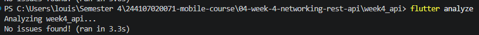
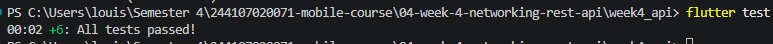

# Week 4 - Networking & REST API

## Deskripsi

Pada praktikum minggu ke-4 ini dipelajari bagaimana aplikasi Flutter berkomunikasi dengan server melalui **REST API** menggunakan protokol **HTTP**. Praktikum memanfaatkan package **Dio** sebagai HTTP client dan **Riverpod** sebagai state management. Selain itu, diterapkan **Repository Pattern** agar pemisahan antara UI dan proses pengambilan data menjadi lebih terstruktur, sehingga aplikasi lebih mudah dikembangkan, diuji, dan dipelihara.

REST API yang digunakan adalah **JSONPlaceholder**, yaitu layanan API gratis yang menyediakan data dummy untuk kebutuhan pembelajaran.

---

# Tujuan

Setelah menyelesaikan praktikum ini, mahasiswa mampu:

* Memahami konsep HTTP, REST API, dan JSON.
* Melakukan parsing JSON ke dalam Model Dart menggunakan `fromJson()` dan `toJson()`.
* Menggunakan package Dio sebagai HTTP client.
* Mengimplementasikan Repository Pattern.
* Menggunakan Riverpod dengan `AsyncNotifier`.
* Menampilkan state **Loading**, **Success**, **Empty**, dan **Error**.
* Mengimplementasikan fitur Refresh Data.
* Menangani error jaringan menggunakan pesan yang ramah bagi pengguna.

---

# Persiapan

Sebelum memulai praktikum, pastikan telah tersedia:

## Software

* Flutter SDK
* Dart SDK
* Visual Studio Code
* Android Studio / Emulator Android
* Git

## Package

Tambahkan dependency berikut:

```bash
flutter pub add dio
flutter pub add flutter_riverpod
```

## REST API

API yang digunakan:

```text
https://jsonplaceholder.typicode.com
```

Endpoint:

```text
GET /posts
```

---

# Konsep Dasar

## HTTP

HTTP (HyperText Transfer Protocol) merupakan protokol komunikasi antara client dan server.

Method HTTP yang digunakan:

| Method      | Fungsi         |
| ----------- | -------------- |
| GET         | Mengambil data |
| POST        | Menambah data  |
| PUT / PATCH | Mengubah data  |
| DELETE      | Menghapus data |

Status Code penting:

| Status Code | Arti                  |
| ----------- | --------------------- |
| 200         | OK                    |
| 201         | Created               |
| 400         | Bad Request           |
| 401         | Unauthorized          |
| 404         | Not Found             |
| 500         | Internal Server Error |

---

## REST API

REST (Representational State Transfer) merupakan arsitektur yang digunakan untuk menyediakan layanan web melalui endpoint HTTP.

Contoh endpoint:

```text
GET https://jsonplaceholder.typicode.com/posts
```

---

## JSON

JSON (JavaScript Object Notation) adalah format pertukaran data yang paling umum digunakan pada REST API.

Contoh data JSON:

```json
{
  "userId": 1,
  "id": 1,
  "title": "sunt aut facere...",
  "body": "quia et suscipit..."
}
```

Data JSON kemudian diubah menjadi objek Dart menggunakan:

* `fromJson()`
* `toJson()`

---

## Repository Pattern

Arsitektur aplikasi pada praktikum ini:

```text
UI
│
▼
Riverpod Provider
│
▼
Repository
│
▼
Dio
│
▼
REST API
```

Keuntungan Repository Pattern:

* UI tidak berhubungan langsung dengan API.
* Networking terpusat.
* Mudah diuji.
* Mudah dikembangkan.

---

# 🛠 Praktikum 1 - Dio dan Model Data

## Tujuan

Membuat model data, menghubungkan aplikasi dengan REST API menggunakan Dio, serta menerapkan Repository Pattern.

## Langkah Praktikum

### 1. Membuat Project

```bash
flutter create week4_api
cd week4_api
flutter pub add dio flutter_riverpod
```

### 2. Membuat Struktur Folder

```text
lib/
├── main.dart
├── data/
│   ├── api_client.dart
│   ├── models/
│   │   └── post.dart
│   └── repositories/
│       └── post_repository.dart
└── pages/
    └── post_list_page.dart
```

### 3. Membuat Model Post

Model memiliki atribut:

* userId
* id
* title
* body

Model menggunakan:

* `factory Post.fromJson()`
* `toJson()`

untuk mengubah JSON menjadi objek Dart dan sebaliknya.

### 4. Konfigurasi Dio

Konfigurasi dilakukan pada `api_client.dart`.

Fitur yang digunakan:

* Base URL
* Connect Timeout
* Receive Timeout
* Default Header
* LogInterceptor

### 5. Membuat Repository

Repository bertugas:

* Mengambil data dari REST API.
* Mengubah JSON menjadi `List<Post>`.
* Mengembalikan data ke Provider.

Repository tidak memiliki kode UI sehingga mengikuti prinsip **Separation of Concerns**.

---

# 🛠 Praktikum 2 - Provider dan Error Handling

## Tujuan

Menghubungkan Repository dengan Riverpod serta menangani berbagai kondisi jaringan menggunakan `AsyncNotifier`.

## Implementasi

### Provider

Digunakan beberapa provider:

* `dioProvider`
* `postRepositoryProvider`
* `postListProvider`

Provider bertugas mengambil data dari Repository dan menyediakan state kepada UI.

---

### State Management

State yang ditangani menggunakan `AsyncValue` meliputi:

* Loading
* Success
* Empty
* Error

---

### Friendly Error Message

Error teknis dari Dio diubah menjadi pesan yang mudah dipahami pengguna.

Contoh:

| Kondisi            | Pesan                            |
| ------------------ | -------------------------------- |
| Timeout            | Koneksi lambat atau timeout.     |
| Tidak ada internet | Tidak dapat terhubung ke server. |
| 404                | Data tidak ditemukan.            |
| 401 / 403          | Akses ditolak.                   |
| Server Error       | Server bermasalah.               |

---

### Tampilan UI

UI dibuat menggunakan `ConsumerWidget` dan `AsyncValue.when()` sehingga dapat menampilkan:

* Loading Indicator
* Daftar Post
* Pesan Error
* Empty State

Selain itu ditambahkan:

* Tombol Refresh
* Pull to Refresh (`RefreshIndicator`)
* Tombol **Coba Lagi** ketika terjadi error.

---

# Uji tiga skenario error

## Skenario 1 - Internet Normal

**Hasil yang diharapkan:**

* Loading muncul.
* Data berhasil diambil.
* 100 post ditampilkan.

**Screenshot**


Pada pengujian ini aplikasi dijalankan dengan koneksi internet yang aktif. Saat pertama kali dijalankan, aplikasi menampilkan **loading indicator (CircularProgressIndicator)** sebagai tanda bahwa proses pengambilan data dari REST API sedang berlangsung. Setelah request berhasil diproses oleh server, aplikasi menampilkan **100 data post** yang diperoleh dari endpoint **JSONPlaceholder** dalam bentuk daftar (`ListView`). Hal ini menunjukkan bahwa konfigurasi **Dio**, **Repository Pattern**, dan **Riverpod AsyncNotifier** telah berjalan dengan baik sehingga proses komunikasi antara aplikasi dan REST API berhasil dilakukan tanpa kendala.

---

## Skenario 2 - Internet Dimatikan

**Hasil yang diharapkan:**

* Muncul pesan error.
* Tombol **Coba Lagi** tampil.
* Setelah internet aktif kembali, data dapat dimuat ulang.

**Screenshot**


Pada pengujian ini, koneksi internet pada perangkat dimatikan kemudian tombol **Refresh** ditekan untuk mengambil data kembali dari REST API. Karena perangkat tidak dapat terhubung ke server, proses request gagal dan menghasilkan **DioException** yang kemudian ditangani oleh **Riverpod AsyncNotifier**. Aplikasi tidak mengalami crash, melainkan menampilkan pesan kesalahan yang ramah bagi pengguna, yaitu *"Tidak dapat terhubung ke server. Periksa internet Anda."* beserta tombol **Coba Lagi**. Setelah koneksi internet diaktifkan kembali dan tombol **Coba Lagi** ditekan, aplikasi berhasil mengambil data dan menampilkannya kembali. Hal ini menunjukkan bahwa mekanisme **error handling** telah berjalan dengan baik serta mampu menangani kondisi kehilangan koneksi internet tanpa mengganggu pengalaman pengguna.

## Skenario 3 - Base URL Salah

**Hasil yang diharapkan:**

* Muncul error koneksi.
* Aplikasi tidak crash.
* Setelah URL diperbaiki, aplikasi berjalan normal.

**Screenshot**


# 📌 Kesimpulan

Pada praktikum ini berhasil dibuat aplikasi Flutter yang mengambil data dari REST API menggunakan **Dio** dan **Riverpod** dengan arsitektur **Repository Pattern**. Aplikasi mampu menangani berbagai kondisi seperti **Loading**, **Success**, **Empty**, dan **Error** melalui `AsyncValue`, serta memberikan pesan kesalahan yang mudah dipahami pengguna. Implementasi ini menghasilkan kode yang lebih terstruktur, mudah dipelihara, dan siap dikembangkan untuk aplikasi yang lebih kompleks.

# 🛠 Praktikum 3 - Pagination Dasar

## Tujuan

Pada praktikum ini mahasiswa mempelajari cara mengimplementasikan **pagination** pada aplikasi Flutter menggunakan REST API. Pagination digunakan agar data tidak diambil sekaligus dalam jumlah besar, tetapi dimuat secara bertahap setiap pengguna melakukan scroll ke bagian bawah halaman (infinite scroll). Dengan cara ini penggunaan memori menjadi lebih efisien dan pengalaman pengguna menjadi lebih baik.

---

# Konsep Pagination

Pagination adalah teknik membagi data menjadi beberapa halaman. API JSONPlaceholder menyediakan parameter query:

```text
?_page=N&_limit=M
```

Contoh:

```text
https://jsonplaceholder.typicode.com/posts?_page=1&_limit=10
```

Artinya:

- `_page=1` → mengambil halaman pertama.
- `_limit=10` → setiap halaman berisi 10 data.

Ketika pengguna melakukan scroll hingga mendekati bagian bawah, aplikasi akan meminta halaman berikutnya tanpa menghapus data yang sudah ditampilkan sebelumnya (**Infinite Scroll**).

---

# Implementasi

Praktikum ini terdiri dari beberapa bagian, yaitu:

- Menambahkan method `fetchPostsPage()` pada `PostRepository`.
- Membuat `PagedPostsState` untuk menyimpan informasi halaman.
- Membuat `PagedPostsNotifier`.
- Membuat tampilan `PagedPostPage`.
- Menggunakan `ScrollController` untuk mendeteksi posisi scroll.
- Menampilkan loading kecil di bagian bawah saat halaman berikutnya sedang dimuat.

---

# Pengujian

## Langkah Pengujian

1. Jalankan aplikasi.
2. Pastikan perangkat terhubung ke internet.
3. Halaman pertama (10 data) akan dimuat secara otomatis.
4. Scroll ke bagian paling bawah.
5. Amati bahwa aplikasi menampilkan loading indicator.
6. Setelah loading selesai, data berikutnya ditambahkan ke daftar tanpa menghapus data sebelumnya.
7. Ulangi proses hingga seluruh data berhasil dimuat.

---

## Hasil yang Diharapkan

- Halaman pertama berisi 10 data berhasil ditampilkan.
- Saat pengguna melakukan scroll hingga mendekati bagian bawah, halaman berikutnya dimuat secara otomatis.
- Loading indicator muncul di bagian bawah daftar.
- Data lama tetap ditampilkan dan data baru ditambahkan.
- Tidak terjadi reload seluruh halaman.
- Ketika seluruh data telah dimuat, muncul informasi **"Semua data termuat."**

---

## Hasil Pengujian

Pengujian berhasil dilakukan. Saat aplikasi pertama kali dijalankan, sistem mengambil **10 data pertama** dari REST API dan menampilkannya pada layar. Ketika pengguna melakukan scroll hingga mendekati bagian bawah daftar, `ScrollController` secara otomatis memanggil method `loadNextPage()`. Selanjutnya aplikasi mengambil halaman berikutnya dari server menggunakan parameter `_page` dan `_limit`, kemudian menambahkan data baru ke daftar yang sudah ada tanpa menghapus data sebelumnya.

Selama proses pengambilan data berikutnya, aplikasi menampilkan **CircularProgressIndicator** di bagian bawah sebagai indikator bahwa proses loading sedang berlangsung. Setelah seluruh data berhasil dimuat, indikator loading akan digantikan dengan tulisan **"Semua data termuat."** Hal ini menunjukkan bahwa implementasi **Infinite Scroll Pagination** telah berjalan sesuai dengan yang diharapkan.

---

## Screenshot


Pada gambar di atas terlihat bahwa aplikasi berhasil menerapkan **Infinite Scroll Pagination**. Ketika pengguna melakukan scroll hingga mendekati bagian bawah daftar, aplikasi secara otomatis mengambil data halaman berikutnya dari REST API. Selama proses tersebut, indikator loading ditampilkan di bagian bawah layar. Setelah proses selesai, data baru ditambahkan ke daftar tanpa menghapus data yang sudah ada sebelumnya. Ketika seluruh data berhasil dimuat, aplikasi menampilkan informasi **"Semua data termuat."**, yang menunjukkan bahwa mekanisme pagination telah bekerja dengan baik.

---

# Kesimpulan

Implementasi pagination menggunakan **Repository Pattern**, **Riverpod**, dan **ScrollController** berhasil dilakukan. Teknik **Infinite Scroll** memungkinkan aplikasi memuat data secara bertahap sehingga lebih efisien dalam penggunaan jaringan dan memori. Pengguna juga memperoleh pengalaman yang lebih baik karena data baru dimuat secara otomatis tanpa perlu melakukan refresh seluruh halaman.

---

# AI Verification Checklist

Checklist ini memverifikasi implementasi pada folder `week4_api` setelah penambahan endpoint komentar `GET /comments?postId={id}`.

| Pemeriksaan | Temuan | Status |
| --- | --- | --- |
| Apakah UI memanggil Dio secara langsung? | UI hanya membaca provider Riverpod. Request Dio berada di repository (`PostRepository` dan `CommentRepository`). | Lulus |
| Apakah `fromJson` aman terhadap field null atau hilang? | `Comment.fromJson` memakai cast nullable dan fallback: angka menjadi `0`, sedangkan teks menjadi string kosong. | Lulus |
| Apakah error Dio dipetakan ke pesan pengguna? | `friendlyErrorMessage` menangani timeout (`connectionTimeout`, `sendTimeout`, `receiveTimeout`), `connectionError`, `404`, `500`, serta status `401/403`. | Lulus |
| Apakah `baseUrl` dan timeout terpusat? | `baseUrl`, `connectTimeout`, `sendTimeout`, dan `receiveTimeout` berada di `lib/data/api_client.dart` dengan nilai 10 detik. Repository tidak mengulang konfigurasi tersebut. | Lulus |
| Apakah test menguji edge case? | `test/comment_test.dart` menguji JSON dengan field `postId`, `name`, dan `body` yang hilang, bukan hanya response lengkap. | Lulus |
| Apakah validasi Flutter berhasil? | `flutter analyze`: `No issues found!`; `flutter test`: `+2: All tests passed!`. | Lulus |

## Bukti Verifikasi

1. **UI tidak memanggil Dio langsung**
  - `lib/pages/paged_post_page.dart` hanya menggunakan `ref.watch(pagedPostsProvider)` dan `ref.read(...)`.
  - Pemanggilan HTTP `dio.get(...)` berada di `lib/data/repositories/comment_repository.dart` dan `lib/data/repositories/post_repository.dart`.

2. **Parsing JSON null-safe**
  - `lib/data/models/comment.dart` menggunakan pola `(json['id'] as num?)?.toInt() ?? 0` dan `json['body'] as String? ?? ''`.
  - `test/comment_test.dart` mengirim JSON parsial yang hanya berisi `id` dan `email`, lalu memverifikasi default `postId`, `name`, dan `body`.

3. **Pemetaan error Dio**
  - `lib/data/providers.dart` memiliki cabang `DioExceptionType.connectionTimeout`, `sendTimeout`, `receiveTimeout`, `connectionError`, dan `badResponse`.
  - Pada `badResponse`, status `404` menghasilkan pesan data tidak ditemukan dan status `500` menghasilkan pesan server bermasalah.

4. **Konfigurasi client terpusat**
  - `lib/data/api_client.dart` memuat `baseUrl` JSONPlaceholder serta `connectTimeout`, `sendTimeout`, dan `receiveTimeout` masing-masing 10 detik.
  - `CommentRepository.fetchComments()` hanya mengirim path `/comments` dan query `postId`; konfigurasi timeout tidak diulang di method tersebut.

5. **Bukti hasil command**

  Command dijalankan dari folder `04-week-4-networking-rest-api/week4_api`:

  ```text
  flutter analyze
  No issues found! (ran in 3.5s)

  flutter test
  00:03 +2: All tests passed!
  ```

Kesimpulan verifikasi: implementasi memenuhi pemisahan UI, provider, repository, dan client HTTP. Error jaringan diubah menjadi `AsyncError` oleh `AsyncNotifier`, lalu dapat ditampilkan menggunakan pesan yang ramah pengguna.

# 🔧 Refactoring dan Testing

## Refactoring Challenge

Pada tahap ini dilakukan refactoring untuk meningkatkan keterbacaan, modularitas, dan kemudahan pemeliharaan kode. Perubahan yang dilakukan meliputi:

### 1. Membuat Widget `PostTile`

Widget yang sebelumnya berada langsung di dalam `ListView.builder` dipindahkan menjadi widget terpisah bernama `PostTile`. Dengan demikian kode pada halaman utama menjadi lebih singkat, mudah dibaca, dan lebih mudah diuji maupun digunakan kembali pada halaman lain.

---

### 2. Memindahkan `friendlyErrorMessage`

Fungsi `friendlyErrorMessage()` dipindahkan ke file:

```text
lib/data/network_errors.dart
```

Tujuannya agar fungsi tersebut dapat digunakan kembali pada halaman **Post List** maupun **Pagination** tanpa perlu menduplikasi kode.

---

### 3. Menambahkan Halaman Detail Post

Ditambahkan halaman **Detail Post** menggunakan **GoRouter**.

Route yang digunakan:

```text
/post/:id
```

Pada halaman ini ditampilkan informasi lengkap berupa:

- Judul Post (`title`)
- Isi Post (`body`)

Data detail diperoleh dari daftar post yang telah dimuat sebelumnya. Apabila halaman dibuka secara langsung, data akan diambil kembali melalui Repository.

---

# 🧪 Testing

Pengujian dilakukan menggunakan package **flutter_test** dengan membuat repository palsu (*Fake Repository*) sehingga proses testing tidak memerlukan koneksi internet.

Seluruh pengujian berada pada file:

```text
test/post_test.dart
```

---

## Pengujian yang Dilakukan

### 1. Pengujian Parsing JSON

Tujuan:

Memastikan `Post.fromJson()` tetap berjalan dengan baik walaupun terdapat field yang hilang.

**Hasil**

- Field `id` berhasil dibaca.
- Field lain otomatis menggunakan nilai default.
- Tidak terjadi crash.

✅ **Status:** Berhasil

---

### 2. Pengujian Friendly Error Message

Tujuan:

Memastikan `DioException` dengan tipe `connectionError` diterjemahkan menjadi pesan yang mudah dipahami pengguna.

**Hasil**

Pesan yang ditampilkan sesuai dengan kondisi error jaringan.

✅ **Status:** Berhasil

---

### 3. Pengujian Provider (Success)

Tujuan:

Memastikan `postListProvider` dapat mengambil data dari `FakePostRepository`.

**Hasil**

Provider berhasil menerima satu data post tanpa melakukan request HTTP ke server.

✅ **Status:** Berhasil

---

### 4. Pengujian Provider (Error)

Tujuan:

Memastikan provider dapat menangani exception yang berasal dari Repository.

**Hasil**

Provider berhasil menghasilkan `AsyncError` dan menampilkan pesan error yang sesuai.

✅ **Status:** Berhasil

---

# ▶️ Menjalankan Testing

Analisis kode:

```bash
flutter analyze
```

Menjalankan seluruh unit test:

```bash
flutter test
```

---

# 📸 Bukti Pengujian

## Hasil Flutter Analyze



**Gambar 5.** Hasil `flutter analyze` menunjukkan tidak terdapat error maupun warning sehingga kode memenuhi standar analisis statis Flutter.

---

## Hasil Flutter Test



**Gambar 6.** Seluruh unit test berhasil dijalankan tanpa kegagalan. Pengujian mencakup parsing JSON, mapping error, provider sukses, dan provider error menggunakan **Fake Repository** tanpa melakukan request HTTP ke server.

---

# ✅ Checklist Verifikasi

| No | Verifikasi | Status |
|----|------------|:------:|
| UI mengakses data melalui Repository | ✅ |
| UI tidak memanggil Dio secara langsung | ✅ |
| Loading State berjalan | ✅ |
| Success State berjalan | ✅ |
| Empty State berjalan | ✅ |
| Error State + Retry berjalan | ✅ |
| Pagination berjalan dengan baik | ✅ |
| Tidak ada request ganda saat scroll | ✅ |
| Seluruh test berhasil dijalankan | ✅ |
| `flutter analyze` tanpa issue | ✅ |
| Dokumentasi AI tersedia pada folder `docs/` | ✅ |

---

# 📌 Kesimpulan

Setelah dilakukan refactoring, struktur project menjadi lebih modular dan mudah dipelihara dengan memisahkan widget, fungsi penanganan error, serta halaman detail ke dalam file yang terpisah. Pengujian menggunakan **Fake Repository** membuktikan bahwa proses testing dapat dilakukan tanpa koneksi internet sehingga hasil pengujian lebih konsisten. Selain itu, hasil **flutter analyze** dan **flutter test** menunjukkan bahwa implementasi aplikasi telah berjalan dengan baik sesuai dengan kebutuhan praktikum.

# 📋 Tugas

## Mini Project / Industry Challenge

Pada tugas minggu ke-4 ini dikembangkan sebuah aplikasi Flutter yang mengambil data dari REST API menggunakan **Dio**, **Riverpod**, dan **Repository Pattern**. Data yang digunakan berasal dari **JSONPlaceholder** (`https://jsonplaceholder.typicode.com/posts`) sehingga aplikasi dapat menampilkan informasi secara dinamis melalui proses komunikasi HTTP. Selain itu, aplikasi juga menerapkan pagination, error handling, serta unit testing sesuai dengan ketentuan praktikum.

---

# ✨ Fitur yang Diimplementasikan

## 1. Mengambil Data dari REST API

Aplikasi berhasil mengambil data dari endpoint **GET /posts** menggunakan package **Dio**. Seluruh proses pengambilan data dilakukan melalui **Repository Pattern**, sehingga UI tidak berhubungan langsung dengan proses networking.

### Bukti


**Gambar 1. Pengambilan Data dari REST API**

Pada saat aplikasi dijalankan dengan koneksi internet yang aktif, aplikasi akan menampilkan **loading indicator** sebagai tanda bahwa proses request sedang berlangsung. Setelah data berhasil diterima dari server, aplikasi menampilkan **100 data post** dalam bentuk daftar (`ListView`). Hal ini membuktikan bahwa proses komunikasi dengan REST API menggunakan Dio telah berjalan dengan baik.

---

## 2. Repository Pattern

Aplikasi menerapkan **Repository Pattern**, sehingga proses komunikasi dengan REST API dipusatkan pada `PostRepository`. Dengan pendekatan ini, UI hanya berinteraksi dengan Provider, sedangkan seluruh proses request dilakukan oleh Repository.

### Bukti

📂 Struktur Project

```text
lib/
├── data/
│   ├── api_client.dart
│   ├── providers.dart
│   ├── models/
│   │   └── post.dart
│   └── repositories/
│       └── post_repository.dart
└── pages/
    └── post_list_page.dart
```

**Penjelasan**

Struktur di atas menunjukkan bahwa proses networking dipisahkan dari UI. Pendekatan ini membuat kode lebih rapi, mudah dipelihara, mudah diuji, dan sesuai dengan konsep **Separation of Concerns**.

---

## 3. Model `fromJson()` Aman Null

Model `Post` menggunakan metode `fromJson()` yang aman terhadap nilai `null` dengan memberikan nilai default apabila terdapat field yang hilang.

### Bukti

```dart
factory Post.fromJson(Map<String, dynamic> json) {
  return Post(
    userId: (json['userId'] as num?)?.toInt() ?? 0,
    id: (json['id'] as num?)?.toInt() ?? 0,
    title: json['title'] as String? ?? '',
    body: json['body'] as String? ?? '',
  );
}
```

**Penjelasan**

Implementasi ini mencegah aplikasi mengalami **crash** ketika API mengirimkan data yang tidak lengkap atau terdapat field yang bernilai `null`.

---

## 4. Konfigurasi Dio Terpusat

Konfigurasi jaringan ditempatkan pada file `api_client.dart`.

Fitur yang digunakan:

- Base URL
- Connect Timeout
- Receive Timeout
- Log Interceptor

**Penjelasan**

Dengan konfigurasi yang terpusat, seluruh request HTTP menggunakan pengaturan yang sama sehingga kode menjadi lebih mudah dikelola dan dikembangkan.

---

## 5. Loading State

Ketika aplikasi sedang mengambil data dari server, akan ditampilkan **CircularProgressIndicator**.

### Bukti


**Gambar 2. Loading State**

Loading indicator muncul selama proses request berlangsung sehingga pengguna mengetahui bahwa aplikasi sedang memproses pengambilan data.

---

## 6. Success State

Setelah request berhasil diproses, aplikasi menampilkan daftar post yang diterima dari REST API.

### Bukti


**Gambar 3. Success State**

Seluruh data berhasil ditampilkan dalam bentuk daftar menggunakan `ListView.builder`.

---

## 7. Error State dan Retry

Aplikasi mampu menangani kondisi ketika koneksi internet terputus maupun server tidak dapat diakses.

### Bukti


**Gambar 4. Error State**

Pada saat koneksi internet dimatikan kemudian tombol **Refresh** ditekan, aplikasi tidak mengalami crash. Sebagai gantinya aplikasi menampilkan pesan:

> **Tidak dapat terhubung ke server. Periksa internet Anda.**

Selain itu tersedia tombol **Coba Lagi** sehingga pengguna dapat melakukan request ulang setelah koneksi kembali tersedia.

---

## 8. Infinite Scroll Pagination

Aplikasi menerapkan **Infinite Scroll Pagination** dengan mengambil **10 data setiap halaman**.

### Bukti


**Gambar 5. Pagination**

Saat pengguna melakukan scroll hingga mendekati bagian bawah daftar, aplikasi secara otomatis mengambil halaman berikutnya menggunakan parameter `_page` dan `_limit`. Data baru ditambahkan ke daftar tanpa menghapus data sebelumnya. Ketika seluruh data berhasil dimuat, aplikasi menampilkan informasi **"Semua data termuat."**

---

## 9. Unit Testing

Pengujian dilakukan menggunakan **Fake Repository** sehingga proses testing tidak memerlukan koneksi internet.

### Bukti


**Gambar 6. Hasil Flutter Test**

Seluruh unit test berhasil dijalankan, meliputi:

- Pengujian `fromJson()`
- Pengujian `friendlyErrorMessage()`
- Pengujian Provider (Success)
- Pengujian Provider (Error)

Hal ini membuktikan bahwa proses parsing data dan state management berjalan sesuai dengan yang diharapkan.

---

## 10. AI Challenge

AI digunakan sebagai alat bantu dalam merancang Repository Layer dan dokumentasi. Seluruh hasil AI kemudian diverifikasi dan diperbaiki secara manual.

### Bukti

📂 Folder Dokumentasi AI

```text
docs/
├── ai_prompt.md
├── ai_output.md
├── ai_revision.md
├── flutter_analyze.png
├── flutter_test.png
└── verification.md
```

**Penjelasan**

Dokumentasi AI berisi prompt yang digunakan, hasil awal AI, perbaikan yang dilakukan, hasil verifikasi, serta bukti bahwa kode telah berhasil dijalankan menggunakan `flutter analyze` dan `flutter test`.

---

# 📂 Struktur Project

```text
04-week-4-networking-rest-api/
├── lib/
├── test/
├── docs/
├── screenshots/
└── README.md
```

---

# 📌 Hasil yang Dicapai

Berdasarkan hasil implementasi dan pengujian, aplikasi berhasil memenuhi seluruh kebutuhan praktikum, yaitu:

- ✅ Mengambil data dari REST API menggunakan Dio.
- ✅ Menggunakan Repository Pattern.
- ✅ Menerapkan Model `fromJson()` yang aman terhadap `null`.
- ✅ Konfigurasi Dio dilakukan secara terpusat.
- ✅ Menampilkan empat state aplikasi (Loading, Success, Empty, Error).
- ✅ Menyediakan tombol Retry ketika terjadi error.
- ✅ Mengimplementasikan Infinite Scroll Pagination.
- ✅ Menggunakan Unit Test tanpa request HTTP sungguhan.
- ✅ Mendokumentasikan penggunaan AI beserta hasil verifikasinya.

# 🤔 Refleksi

## 1. Mengapa UI dilarang memanggil Dio langsung? Apa yang rusak jika aturan ini dilanggar?

UI tidak diperbolehkan memanggil Dio secara langsung karena akan menyebabkan **tight coupling** antara tampilan aplikasi dengan proses pengambilan data. Jika UI melakukan request HTTP secara langsung, maka setiap perubahan pada API atau proses networking akan mengharuskan perubahan pada halaman UI. Akibatnya kode menjadi sulit dipelihara, sulit diuji, dan sulit digunakan kembali.

Dengan menerapkan **Repository Pattern**, UI hanya bertugas menampilkan data, sedangkan seluruh proses komunikasi dengan server dilakukan oleh Repository. Pendekatan ini membuat struktur aplikasi lebih rapi, modular, dan mudah dikembangkan.

---

## 2. Kapan pagination client-side cukup, dan kapan harus menggunakan pagination server (`_page`/`_limit`)?

Pagination **client-side** cocok digunakan ketika jumlah data relatif sedikit sehingga seluruh data dapat diambil sekaligus tanpa memberikan beban yang besar terhadap jaringan maupun memori aplikasi.

Sebaliknya, **server-side pagination** lebih tepat digunakan ketika jumlah data sangat banyak. Pada metode ini server hanya mengirimkan sebagian data sesuai parameter `_page` dan `_limit`, sehingga penggunaan bandwidth, memori, dan waktu loading menjadi lebih efisien. Pada praktikum ini digunakan **server-side pagination** karena data diambil secara bertahap dari REST API menggunakan parameter tersebut.

---

## 3. Bagaimana exception Repository berubah menjadi `AsyncError` tanpa try/catch di setiap widget? Kapan try/catch eksplisit tetap dibutuhkan?

Repository tidak menangani exception yang terjadi selama proses request HTTP, melainkan meneruskannya ke Provider. Riverpod melalui `AsyncNotifier` akan secara otomatis mengubah exception tersebut menjadi **AsyncError**. Dengan demikian, widget cukup membaca state menggunakan `AsyncValue.when()` untuk menampilkan kondisi **Loading**, **Success**, maupun **Error** tanpa perlu menulis `try/catch` pada setiap halaman.

`try/catch` secara eksplisit tetap diperlukan ketika ingin melakukan proses tertentu, misalnya saat melakukan **refresh data**, menyimpan log error, melakukan retry manual, atau ketika ingin mengubah state secara langsung setelah terjadi kegagalan.

---

## 4. Bagian mana dari hasil AI yang Anda perbaiki, dan mengapa?

AI membantu menghasilkan struktur awal project, namun beberapa bagian masih perlu disesuaikan agar sesuai dengan kebutuhan praktikum. Perbaikan yang dilakukan meliputi:

- Menambahkan **null safety** pada method `fromJson()` agar aplikasi tidak mengalami crash ketika terdapat field yang hilang.
- Memusatkan konfigurasi **Base URL**, **Timeout**, dan **Interceptor** ke dalam `api_client.dart`.
- Menambahkan fungsi `friendlyErrorMessage()` agar pesan kesalahan lebih mudah dipahami oleh pengguna.
- Memastikan seluruh akses data dilakukan melalui **Repository Pattern**, bukan langsung dari UI.
- Menambahkan **Pagination** menggunakan `_page` dan `_limit`.
- Menambahkan **Unit Test** menggunakan **Fake Repository** agar proses testing tidak memerlukan koneksi internet.
- Melakukan pengecekan menggunakan `flutter analyze` dan `flutter test` untuk memastikan kode berjalan dengan baik tanpa warning maupun error.

Perbaikan tersebut dilakukan agar implementasi sesuai dengan standar pengembangan Flutter, memenuhi ketentuan praktikum, serta menghasilkan aplikasi yang lebih mudah dipelihara dan dikembangkan.

---

# 💡 Pembelajaran yang Diperoleh

Melalui praktikum ini saya memahami cara membangun aplikasi Flutter yang terhubung dengan REST API menggunakan arsitektur yang lebih baik melalui **Repository Pattern** dan **Riverpod**. Saya juga mempelajari pentingnya pemisahan tanggung jawab antar layer, penanganan error yang baik, penggunaan pagination untuk meningkatkan efisiensi pengambilan data, serta pentingnya pengujian menggunakan unit test. Selain itu, saya menyadari bahwa AI dapat membantu mempercepat proses pengembangan, namun seluruh hasil tetap harus diverifikasi dan dipahami sebelum digunakan pada aplikasi.